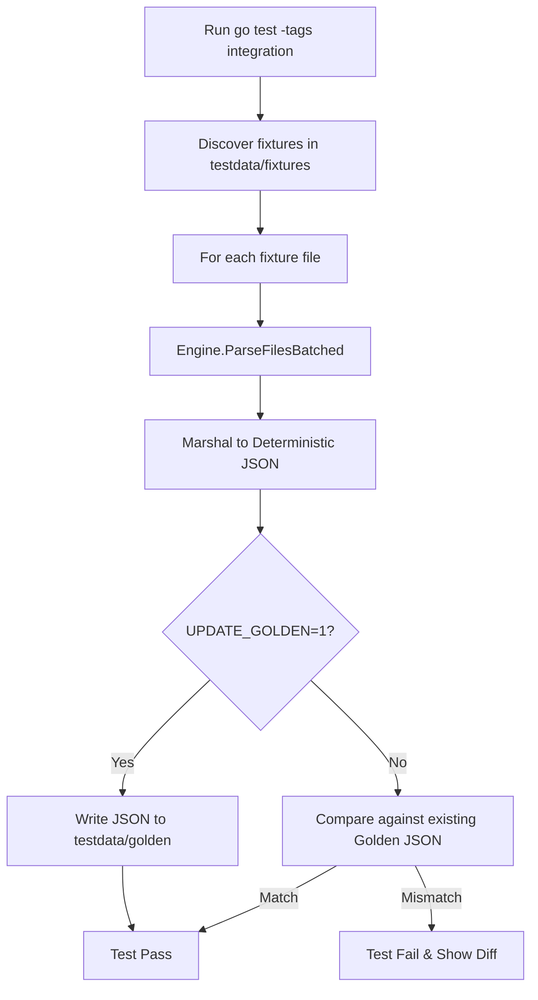
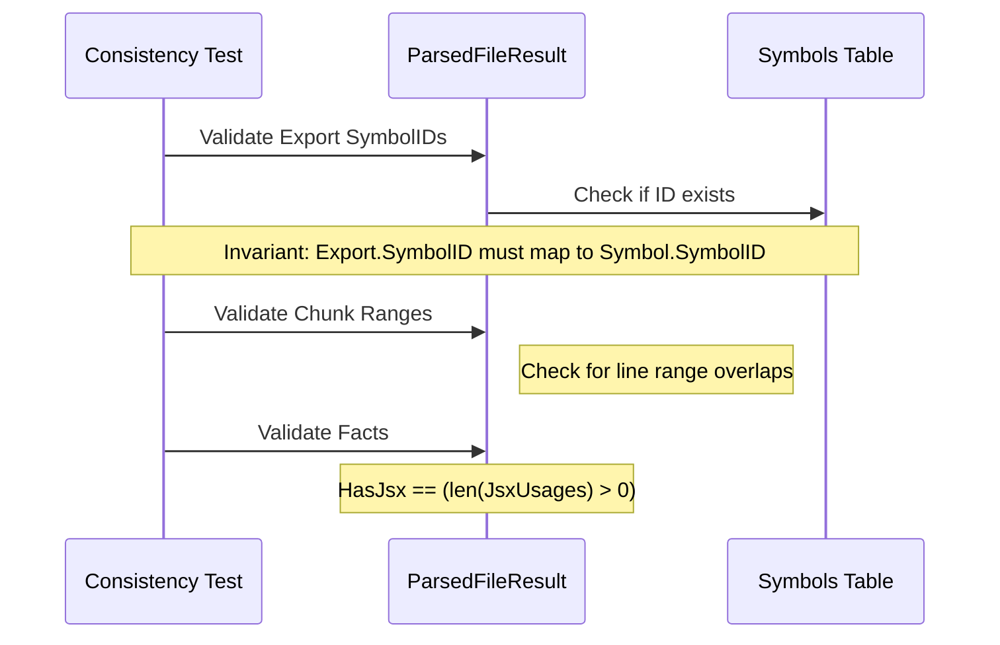

Relevant source files

The following files were used as context for generating this wiki page:

- [concept/tickets/backend-worker/05-parser-engine.md](https://github.com/YannickTM/code-intelegence/blob/main/concept/tickets/backend-worker/05-parser-engine.md)
- [backend-worker/internal/parser/golden_test.go](https://github.com/YannickTM/code-intelegence/blob/main/backend-worker/internal/parser/golden_test.go)
- [backend-worker/internal/parser/determinism_test.go](https://github.com/YannickTM/code-intelegence/blob/main/backend-worker/internal/parser/determinism_test.go)
- [backend-worker/internal/parser/consistency_test.go](https://github.com/YannickTM/code-intelegence/blob/main/backend-worker/internal/parser/consistency_test.go)
- [backend-api/tests/integration/setup_test.go](https://github.com/YannickTM/code-intelegence/blob/main/backend-api/tests/integration/setup_test.go)
- [concept/tickets/backend-api/01-foundation.md](https://github.com/YannickTM/code-intelegence/blob/main/concept/tickets/backend-api/01-foundation.md)

# Testing & Golden Assertions

Testing within the project is structured around a multi-tiered strategy designed to ensure the reliability of the parsing engine, API integrity, and cross-component consistency. A core component of this strategy is the use of **Golden Assertions** (snapshot testing), which validates the output of complex parsing pipelines against committed JSON "golden files." This ensures that regressions in extractor logic or data structures are caught during the CI process.

The testing suite encompasses integration tests for the `parser.Engine`, determinism verification, cross-extractor invariant checks, and full API lifecycle tests using real database instances. These tests often require the `//go:build integration` tag and `CGO_ENABLED=1` to exercise the full capabilities of the underlying Tree-sitter parsers. Sources: [concept/tickets/backend-worker/05-parser-engine.md](), [backend-worker/internal/parser/consistency_test.go:1-10]().

## Parser Integration & Golden Testing

The `parser.Engine` is validated by feeding real multi-file source code through the pipeline and comparing the serialized `ParsedFileResult` against deterministic JSON snapshots. This process catches regressions that unit tests on individual extractors might miss.

### Golden File Harness
The golden test harness (`golden_test.go`) follows a specific execution flow:
1. **Discovery**: Scans `testdata/fixtures/<lang>/` for source files.
2. **Execution**: Calls `engine.ParseFilesBatched()` to generate results.
3. **Serialization**: Converts results to deterministic JSON (sorted keys, stable field order).
4. **Comparison**: Compares the output against `testdata/golden/<lang>/<name>.json`.
5. **Updating**: Allows overwriting golden files when the `UPDATE_GOLDEN=1` environment variable is set.

Sources: [concept/tickets/backend-worker/05-parser-engine.md]()

### Test Infrastructure Flow
The following diagram illustrates the lifecycle of a golden snapshot test:

This process ensures that any changes to the extraction logic are explicitly reviewed and committed as new golden snapshots. Sources: [concept/tickets/backend-worker/05-parser-engine.md]()

## Determinism Verification
Determinism tests ensure that the parsing pipeline produces byte-identical output across multiple runs and concurrent executions. This is critical for preventing non-deterministic goroutine scheduling or map iteration leaks from affecting the system's stability.

| Test Name | Methodology | Goal |
| :--- | :--- | :--- |
| `TestDeterminism_FullPipeline` | Parses a batch of 5+ files N=10 times sequentially. | Catch leaks in map iteration or timestamps. |
| `TestDeterminism_ConcurrentBatches` | Launches 5 goroutines parsing the same batch simultaneously. | Verify thread-safety and pool isolation. |

Sources: [concept/tickets/backend-worker/05-parser-engine.md](), [backend-worker/internal/parser/determinism_test.go]()

## Cross-Extractor Consistency
Consistency tests (`consistency_test.go`) validate invariants across different extractors within the same file result. This ensures that relationships between symbols, exports, and chunks are logically sound.

### Invariant Checks
*   **Export-Symbol Consistency**: Every `Export.SymbolID` must reference an existing symbol in `result.Symbols`.
*   **Chunk Boundary Integrity**: No two chunks may have overlapping line ranges.
*   **Reference Validity**: Reference positions must remain within file bounds (1 to `LineCount`).
*   **Fact Consistency**: Boolean facts (e.g., `HasJsx`) must match the actual presence of related data (e.g., `JsxUsages`).

Sources: [concept/tickets/backend-worker/05-parser-engine.md](), [backend-worker/internal/parser/consistency_test.go:45-130]()

Sources: [concept/tickets/backend-worker/05-parser-engine.md]()

## API Integration Testing
At the API level, integration tests verify the full request lifecycle against real PostgreSQL instances using `testcontainers-go`. This infrastructure supports high-fidelity testing of RBAC, project membership, and complex database transactions.

### Test Environment Setup
The `setupTestApp` helper initializes the environment for every test suite:
1. **Container Start**: Spins up `postgres:16-alpine`.
2. **Migrations**: Executes all SQL migrations to bring the schema to the latest version.
3. **App Bootstrap**: Creates an `app.App` instance with test configuration.
4. **Cleanup**: Provides a function to truncate all tables and close connection pools.

Sources: [backend-api/tests/integration/setup_test.go](), [concept/tickets/backend-api/01-foundation.md]()

### Test Utility Helpers
Common helpers are used to reduce boilerplate in API tests:
*   `doRequest`: Performs an in-process HTTP request using `httptest.NewRecorder`.
*   `asUser`: Injects `X-Username` headers for identity simulation.
*   `truncateAll`: Clears database state between individual test cases.

Sources: [concept/tickets/backend-api/01-foundation.md]()

## Performance Baselines
Benchmark tests using Go's `testing.B` provide performance baselines for the parsing engine. These track latency and memory allocations per file and per batch.

| Benchmark | Focus | Description |
| :--- | :--- | :--- |
| `BenchmarkEngine_SingleFile_TS` | Latency | Single-file TypeScript parsing performance. |
| `BenchmarkEngine_Batch50_TS` | Contention | Exercises parser pool contention with 50 concurrent copies. |

Sources: [concept/tickets/backend-worker/05-parser-engine.md]()

Testing and Golden Assertions provide the primary defense against regressions in the project's complex multi-language parsing environment. By combining golden snapshots, determinism checks, and containerized API tests, the project maintains a high standard of technical accuracy and cross-component reliability.
