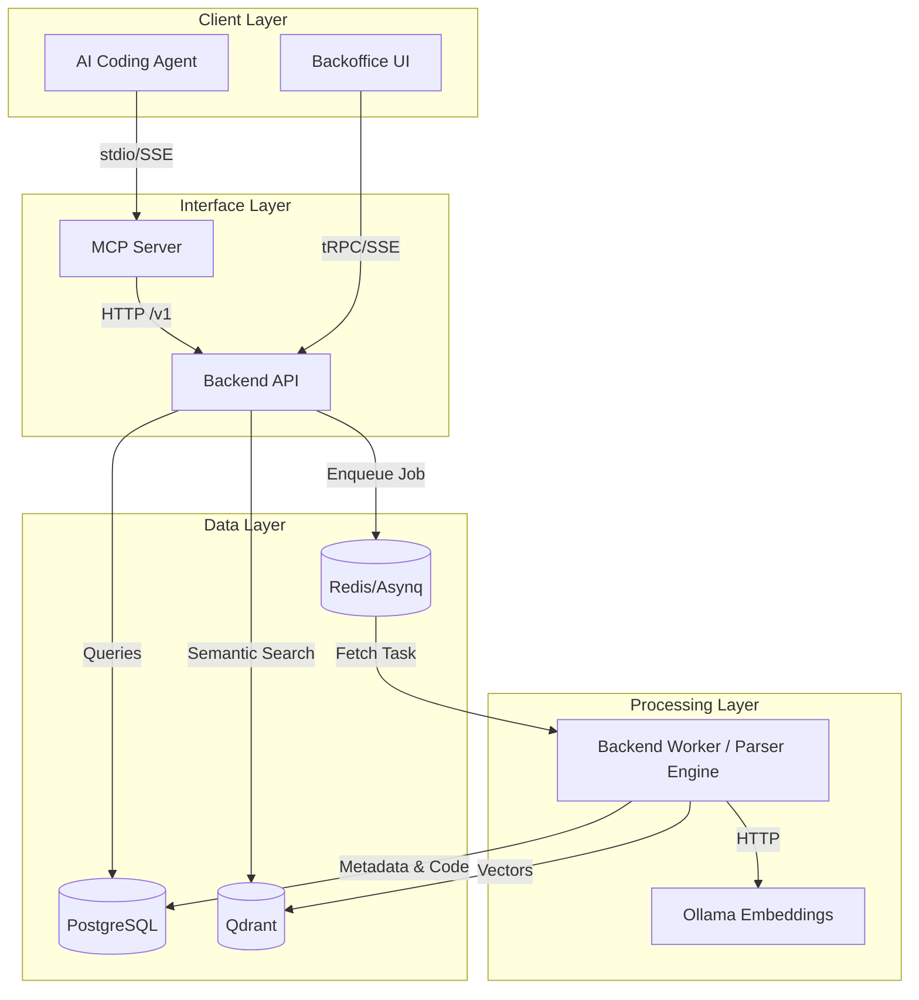
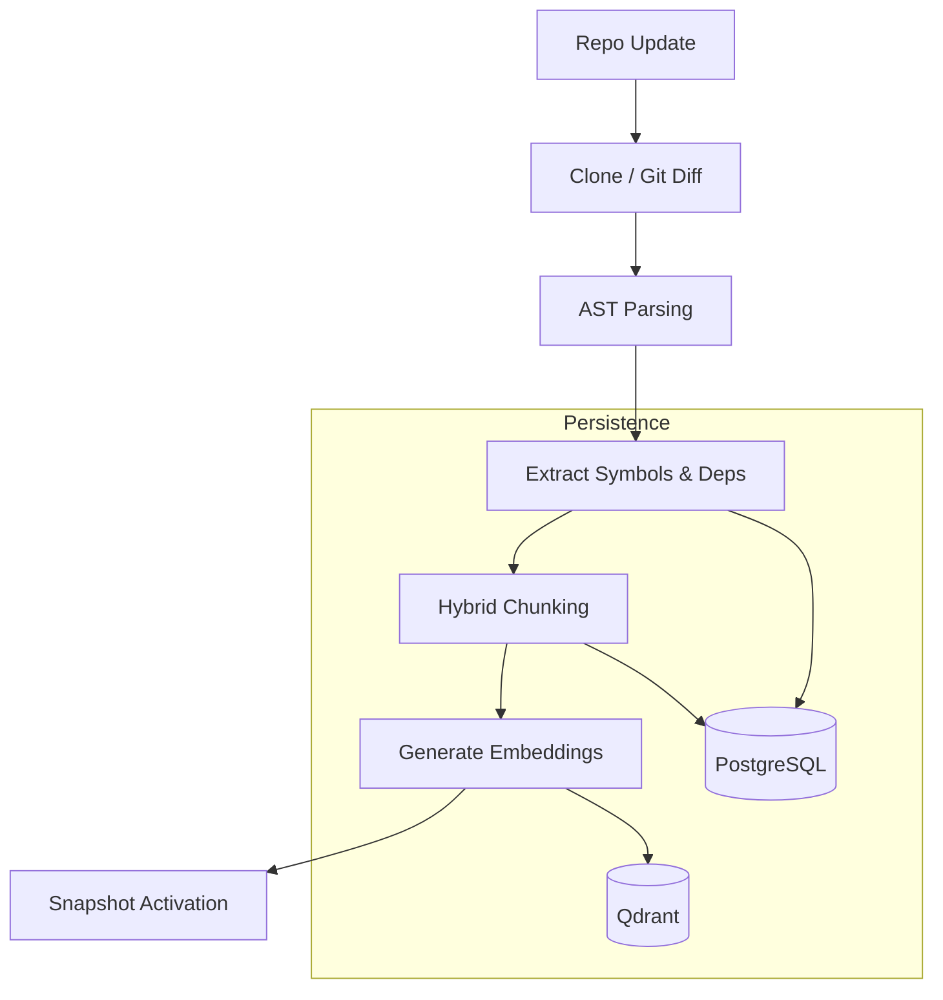

Relevant source files

The following files were used as context for generating this wiki page:

- [README.md](https://github.com/YannickTM/code-intelegence/blob/main/README.md)
- [concept/01-system-overview.md](https://github.com/YannickTM/code-intelegence/blob/main/concept/01-system-overview.md)
- [concept/tickets/backend-api/01-foundation.md](https://github.com/YannickTM/code-intelegence/blob/main/concept/tickets/backend-api/01-foundation.md)

# High-Level Architecture

MYJUNGLE is a persistent code intelligence platform designed to serve AI coding agents with deep, pre-indexed knowledge of codebases. Instead of agents re-analyzing repositories for every session, MYJUNGLE provides a persistent knowledge layer accessible via the Model Context Protocol (MCP). The system ingests repositories, performs deep AST and dependency analysis, and stores this information in a dual-store model comprising a relational database and a vector database.

Sources: [README.md:3-6](), [concept/01-system-overview.md:3-12]()

## System Components

The architecture follows a modular service-oriented approach, utilizing Go for backend services and the embedded parser engine, and TypeScript for the frontend and MCP tooling.

### Core Services
*   **Backend API (Go):** The central orchestrator that validates authentication, serves queries, and manages project lifecycles. It uses the `chi` router and provides a versioned `/v1` REST API.
*   **Backend Worker (Go):** Executes asynchronous indexing pipeline tasks. It consumes jobs from a Redis queue, runs the embedded Tree-sitter parser engine, and performs embedding and persistence stages.
*   **MCP Server (TypeScript):** Implements the Model Context Protocol to expose tools like `search_code` and `get_symbol_info` to external AI agents.

Sources: [README.md:14-25]()

### Data Storage
The system employs a dual-store strategy to balance structured metadata and semantic retrieval.

| Component | Technology | Role |
| :--- | :--- | :--- |
| **Relational DB** | PostgreSQL | Stores structured metadata (files, symbols, dependencies), raw code chunks, and system state. |
| **Vector DB** | Qdrant | Stores chunk embeddings for semantic retrieval. |
| **Queue/PubSub** | Redis | Managed via `asynq` for job orchestration and real-time event broadcasting. |

Sources: [README.md:26-30]()

## Runtime Topology and Data Flow

The following diagram illustrates the interaction between external agents, core services, and the data persistence layer.

The topology ensures that internal data stores like PostgreSQL and Qdrant are never directly accessed by the MCP server, maintaining a clear security boundary.

Sources: [README.md:34-42](), [README.md:108-111]()

## Ingestion Pipeline

The ingestion process transforms raw source code into queryable knowledge products. It follows a multi-stage flow:

1.  **Clone/Pull:** The system retrieves the repository using Git authentication (SSH keys).
2.  **Parse:** The `backend-worker` parses files directly using its embedded Tree-sitter engine to extract symbols (functions, classes) and dependencies.
3.  **Chunk:** Code is broken into hybrid chunks (module-level, function-level, and class-level).
4.  **Embed:** Chunks are sent to Ollama to generate vector representations.
5.  **Store:** Metadata is persisted in PostgreSQL, while embeddings are upserted into Qdrant.

Indexing is incremental by default, using `git diff` to process only changed files, which reduces latency and computational cost.

## Backend API Architecture

The `backend-api` is structured for high maintainability and testability using a clean internal layout and dependency injection.

### Project Structure
*   **`cmd/api/main.go`:** Entry point for configuration loading and server startup.
*   **`internal/app/`:** Contains the `App` struct, route registration, and server lifecycle management.
*   **`internal/handler/`:** Implements HTTP handlers that interact with the domain layer.
*   **`internal/domain/`:** Defines core models (Project, User, Snapshot) and domain errors.
*   **`internal/middleware/`:** Provides cross-cutting concerns like logging, CORS, and recovery.

Sources: [concept/tickets/backend-api/01-foundation.md]()

### Middleware Chain
Requests passing through the API traverse a specific middleware chain to ensure security and observability:
1.  **RequestID:** Injects unique `X-Request-ID` for tracing.
2.  **Logging & Metrics:** Captures request performance and status.
3.  **Recover:** Catches panics to prevent service crashes.
4.  **CORS:** Manages cross-origin resource sharing for the Backoffice UI.
5.  **BodyLimit:** Rejects payloads over a configured limit (e.g., 1MB).

Sources: [concept/tickets/backend-api/01-foundation.md](), [concept/tickets/backend-api/01-foundation.md]()

## Data Consistency and Versioning

MYJUNGLE enforces strict isolation between different versions of code and embeddings.
*   **Snapshots:** All data (files, symbols, vectors) is bound to an `index_snapshot_id`. Query responses never blend data from different snapshots.
*   **Embedding Isolation:** Embeddings from different model versions are never mixed in the same collection to prevent vector space corruption.
*   **Multi-Project Scope:** Data models and API keys are designed to support multiple projects from the start, utilizing join tables (e.g., `api_key_projects`) to manage access.

## Summary

The high-level architecture of MYJUNGLE provides a robust foundation for persistent code intelligence. By separating concerns between a high-performance Go backend, an embedded parser engine in `backend-worker`, and a dual-store data layer, the system achieves scalable semantic search and structured code analysis. The use of MCP as an interface standard ensures that the platform remains interoperable with a wide range of AI coding agents while maintaining strict data governance and versioning.
