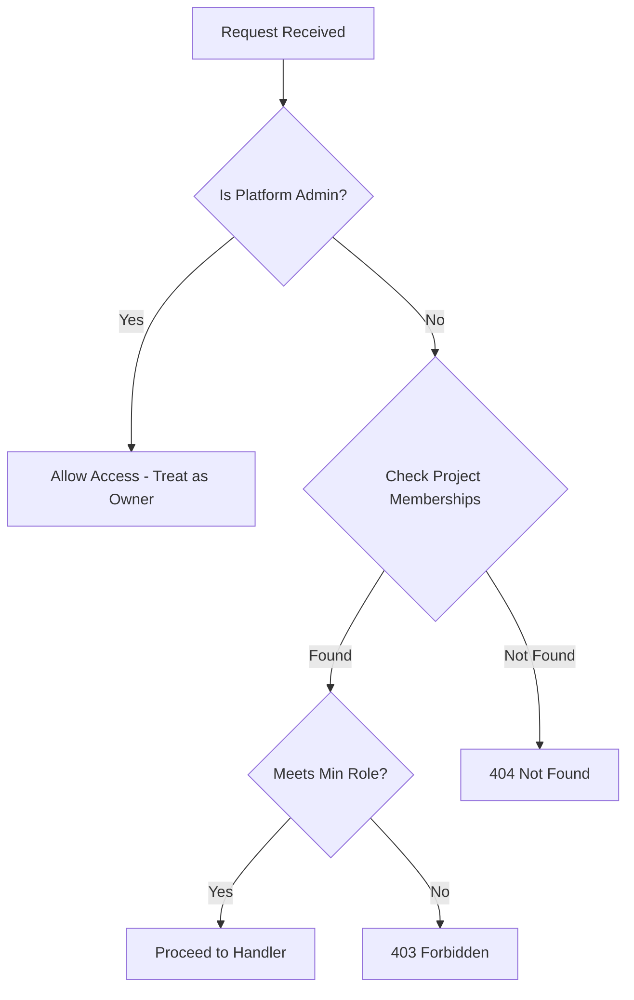

Relevant source files

The following files were used as context for generating this wiki page:

- [README.md](https://github.com/YannickTM/code-intelegence/blob/main/README.md)
- [documentation/project-livecycle.md](https://github.com/YannickTM/code-intelegence/blob/main/documentation/project-livecycle.md)
- [concept/tickets/backend-api/07-api-key-management.md](https://github.com/YannickTM/code-intelegence/blob/main/concept/tickets/backend-api/07-api-key-management.md)
- [concept/08-platform-admin.md](https://github.com/YannickTM/code-intelegence/blob/main/concept/08-platform-admin.md)
- [concept/tickets/backend-api/01-foundation.md](https://github.com/YannickTM/code-intelegence/blob/main/concept/tickets/backend-api/01-foundation.md)

# Security Baseline & Access Controls

## Introduction

The security architecture of the MYJUNGLE Code Intelligence Platform is built on the principle of project-scoped isolation and multi-layered access control. It ensures that code intelligence data—including indexed symbols, file structures, and semantic vectors—is only accessible to authorized users and automated agents. The system distinguishes between human administrative access via the Backoffice and programmatic access via Model Context Protocol (MCP) tools.

The baseline security posture relies on hashed secrets, encrypted-at-rest credentials, and a strict role hierarchy. Internal service communication is restricted to a dedicated Docker network, while external access is gated by identity resolvers that enforce project-level permissions on every request.

Sources: [README.md:1-10]()

## Identity & Authentication

The platform utilizes three primary forms of identity to gate access: authenticated browser sessions for users, API keys for agents, and SSH keys for repository access.

### User Sessions and Backoffice Auth
In the initial phase, the Backoffice operates on local/trusted networks without a built-in authentication layer. However, Phase 2 implements a `platform_admin` role and integrates with external OIDC/OAuth2 gateways. User identity is resolved from session cookies or trusted headers provided by these external layers.

Sources: [concept/05-backoffice-ui.md:12-23](), [concept/08-platform-admin.md:5-15]()

### API Key Management
API keys are the primary mechanism for MCP agent authentication. They are categorized into two types:
*   **Project Keys**: Scoped to a specific project.
*   **Personal Keys**: Scoped to all projects where the user holds membership.

All API keys are stored as SHA-256 hashes in PostgreSQL. Plaintext keys are only shown once during creation and are never stored or logged.

Sources: [concept/tickets/backend-api/07-api-key-management.md]()

### Git Authentication
Repository access is secured via reusable SSH key pairs. Private keys are encrypted at rest within the PostgreSQL database. These keys are used by the `backend-worker` to clone and fetch code from remote Git providers.

Sources: [README.md:12](), [README.md:86](), [documentation/project-livecycle.md:41-43]()

## Access Control Model (RBAC)

MYJUNGLE employs a hierarchical Role-Based Access Control (RBAC) system that operates at both the project and platform levels.

### Project-Scoped Roles
Access to project data is governed by a three-tier hierarchy stored in the `project_members` table.

| Role | Rank | Description |
| :--- | :--- | :--- |
| **Owner** | 3 | Full control, including project deletion and ownership transfers. |
| **Admin** | 2 | Can manage members, SSH keys, API keys, and trigger indexing. |
| **Member** | 1 | Read-only access to files, symbols, and search tools. |

Sources: [documentation/project-livecycle.md:89-95]()

### Platform Administration
The `platform_admin` role is a system-level role that bypasses standard project membership checks.

*The diagram shows the authorization middleware logic for project-scoped requests.*

Sources: [concept/08-platform-admin.md:19-33]()

### API Key Permissions
API keys use a simplified two-level role system:
*   **read**: Equivalent to the project `member` role.
*   **write**: Equivalent to the project `admin` role (allows triggering indexing).

For Personal Keys, the effective role is calculated as `MIN(key_role, membership_role)`.

Sources: [documentation/project-livecycle.md:113-120](), [concept/tickets/backend-api/07-api-key-management.md]()

## Network & Infrastructure Security

### Internal Isolation
The platform runtime topology isolates internal services (PostgreSQL, Qdrant, Redis, and the `backend-worker` runtime that hosts the parser engine) from direct external exposure. The MCP server serves as the gateway for agents but does not have direct access to the databases; it must communicate via the `backend-api`.

Sources: [README.md:21-31]()

### Middleware & Request Validation
Every incoming request to the API undergoes a standard security and validation pipeline:

1.  **Panic Recovery**: Catches runtime errors to prevent server crashes.
2.  **Request ID**: Generates an `X-Request-ID` for auditability.
3.  **CORS Enforcement**: Restricted via `CORS_ALLOWED_ORIGINS`.
4.  **Body Limit**: Rejects request bodies exceeding 1MB (413 Payload Too Large).
5.  **Identity Resolution**: Resolves the caller's role (User or API Key).

Sources: [concept/tickets/backend-api/01-foundation.md](), [documentation/project-livecycle.md:162-168]()

## Data Security & Invariants

### Snapshot Isolation
Semantic search and structure queries are strictly scoped to snapshots. The system enforces "Embedding Version Isolation," ensuring vectors from different models are never mixed, which prevents score corruption and accidental data leakage across incompatible vector spaces.

### Critical Security Invariants
*   **Ownership Invariant**: A project must always have at least one active owner. The system blocks any demotion or removal that would result in zero owners.
*   **Non-Member Visibility**: If a user is not a member of a project and lacks platform admin rights, the system returns a **404 Not Found** instead of a 403. This hides the existence of projects from unauthorized parties (ADR-008).

Sources: [documentation/project-livecycle.md:108-111](), [documentation/project-livecycle.md:154-156]()

## Summary

The security baseline of MYJUNGLE prioritizes repository integrity and access auditability. By using hashed API keys, encrypted SSH credentials, and a robust middleware pipeline, the platform maintains a strong defensive posture suitable for indexing sensitive codebases. The dual-tier RBAC system allows for granular control at the project level while providing necessary oversight through platform administration roles.

Sources: [README.md:85-88]()
