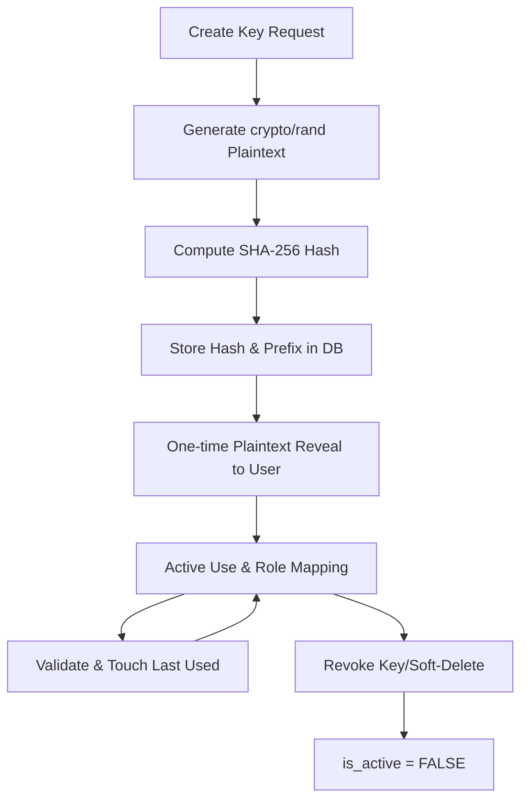
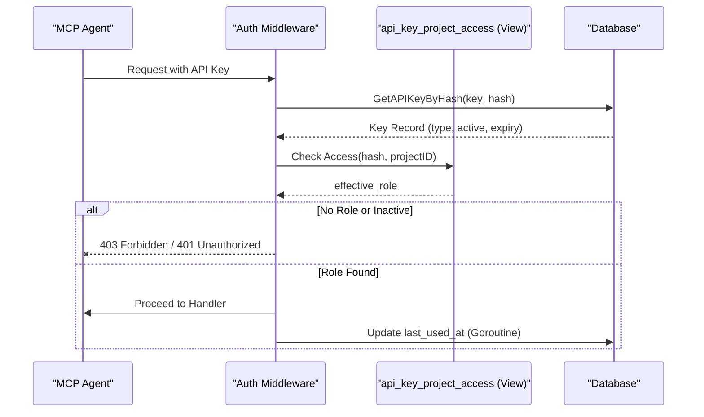

Relevant source files

The following files were used as context for generating this wiki page:

- [concept/tickets/backend-api/07-api-key-management.md](https://github.com/YannickTM/code-intelegence/blob/main/concept/tickets/backend-api/07-api-key-management.md)
- [concept/tickets/backoffice/05-project-providers-keys.md](https://github.com/YannickTM/code-intelegence/blob/main/concept/tickets/backoffice/05-project-providers-keys.md)
- [concept/tickets/backoffice/13-user-settings.md](https://github.com/YannickTM/code-intelegence/blob/main/concept/tickets/backoffice/13-user-settings.md)
- [documentation/project-livecycle.md](https://github.com/YannickTM/code-intelegence/blob/main/documentation/project-livecycle.md)
- [concept/tickets/backend-api/01-foundation.md](https://github.com/YannickTM/code-intelegence/blob/main/concept/tickets/backend-api/01-foundation.md)

# API Key Lifecycle & Role Mapping

## Introduction

The API Key Management system in MyJungle provides programmatic access to project data and Model Context Protocol (MCP) server actions. It distinguishes between two primary types of keys: **Project Keys**, which are scoped to a specific project and managed by administrators, and **Personal Keys**, which inherit the user's project memberships and are managed by the individual user. This system is designed to provide secure, auditable access that is separate from standard backoffice user sessions.

The lifecycle of an API key involves generation with secure hashing, visual type identification via prefixes, one-time plaintext exposure, and dynamic role mapping. Role mapping ensures that a key's permissions are always constrained by both the key's assigned role and the underlying project membership level of the creator or the project itself. Sources: [concept/tickets/backend-api/07-api-key-management.md](), [documentation/project-livecycle.md:144-152]()

## API Key Architecture

### Key Types and Formats
API keys use a specific format that allows for easy visual identification in logs and configurations. Each key consists of a prefix, followed by 32 random characters generated using a cryptographically secure random number generator.

| Key Type | Prefix | Format | Access Scope |
| :--- | :--- | :--- | :--- |
| **Project** | `mj_proj_` | `mj_proj_<32 chars>` | Exactly one project; static role. |
| **Personal** | `mj_pers_` | `mj_pers_<32 chars>` | All projects where the user is a member; dynamic role. |

Sources: [concept/tickets/backend-api/07-api-key-management.md](), [concept/tickets/backoffice/13-user-settings.md]()

### Security Constraints
The system prioritizes security through several technical constraints:
*   **One-time Reveal:** The plaintext key is returned exactly once upon creation and is never stored in its raw form.
*   **Hashing:** Only the SHA-256 hash of the full plaintext key is stored in the database.
*   **Prefix Storage:** A 12-character prefix is stored for display purposes to help users identify keys in the UI without compromising the full key.
*   **Immutability:** The `key_type` of a key cannot be changed after creation.

Sources: [concept/tickets/backend-api/07-api-key-management.md](), [concept/tickets/backoffice/05-project-providers-keys.md]()

## API Key Lifecycle

The lifecycle follows a standard path from creation through active use to revocation (soft-delete).

This diagram illustrates the sequence from generation to deactivation. Sources: [concept/tickets/backend-api/07-api-key-management.md](), [concept/tickets/backoffice/05-project-providers-keys.md]()

### Creation and Validation
Key creation requires specific validation rules:
*   **Name:** Optional, 1-100 characters.
*   **Role:** Optional, defaults to `read`. Must be `read` or `write`.
*   **Expiration:** Optional, but `expires_at` must be in the future if provided.
*   **Permissions:** Project keys require `admin` or `owner` role on the project. Personal keys require a valid user session.

Sources: [concept/tickets/backend-api/07-api-key-management.md](), [concept/tickets/backend-api/01-foundation.md]()

### Revocation (Deletion)
"Deletion" in the system is implemented as a **soft-delete**. When a key is deleted, the `is_active` flag is set to `FALSE`. The key remains in the database for audit purposes but is immediately excluded from all access checks and UI lists. Sources: [concept/tickets/backoffice/13-user-settings.md](), [concept/tickets/backoffice/05-project-providers-keys.md]()

## Role Mapping and Access Logic

Role mapping differs significantly between key types. While Project Keys have a fixed effective role, Personal Keys utilize a dynamic mapping based on the user's membership.

### Mapping Logic for Personal Keys
The effective role for a personal key on a specific project is calculated as the minimum of the key's assigned role and the user's project membership role: `effective_role = MIN(key_role, mapped_membership_role)`.

| User Membership Role | API Role Equivalent |
| :--- | :--- |
| **Owner** | `write` |
| **Admin** | `write` |
| **Member** | `read` |

Sources: [concept/tickets/backend-api/07-api-key-management.md](), [documentation/project-livecycle.md:144-150]()

### Role Access Levels
The system maps API roles to specific functional capabilities within a project.

| Role | Access Level | Capabilities |
| :--- | :--- | :--- |
| `read` | Member-level | Read-only access to symbols, files, structure, and search. |
| `write` | Admin-level | Data access plus mutations, such as triggering indexing. |

**Note:** API keys are never granted `owner` level permissions; operations like project deletion or ownership transfer require a session-authenticated user. Sources: [documentation/project-livecycle.md:144-152](), [concept/tickets/backend-api/07-api-key-management.md]()

### Validation Sequence (MCP Auth Middleware)
The authentication middleware resolves access by querying the unified `api_key_project_access` view.

The view automatically handles filtering for `is_active = TRUE` and non-expired keys. Sources: [concept/tickets/backend-api/07-api-key-management.md](), [concept/tickets/backend-api/07-api-key-management.md]()

## API Endpoints

### Project-Scoped Keys
Managed under `/v1/projects/{projectID}/keys`.

| Method | Endpoint | Handler | Required Role |
| :--- | :--- | :--- | :--- |
| `POST` | `/v1/projects/{projectID}/keys` | `HandleCreateProjectKey` | admin+ |
| `GET` | `/v1/projects/{projectID}/keys` | `HandleListProjectKeys` | member+ |
| `DELETE` | `/v1/projects/{projectID}/keys/{keyID}` | `HandleDeleteProjectKey` | admin+ |

Sources: [concept/tickets/backend-api/07-api-key-management.md](), [concept/tickets/backoffice/05-project-providers-keys.md]()

### User-Scoped Personal Keys
Managed under `/v1/users/me/keys`.

| Method | Endpoint | Handler | Required Role |
| :--- | :--- | :--- | :--- |
| `POST` | `/v1/users/me/keys` | `HandleCreatePersonalKey` | session |
| `GET` | `/v1/users/me/keys` | `HandleListPersonalKeys` | session |
| `DELETE` | `/v1/users/me/keys/{keyID}` | `HandleDeletePersonalKey` | session |

Sources: [concept/tickets/backend-api/07-api-key-management.md](), [concept/tickets/backoffice/13-user-settings.md]()

## Summary
The API Key system provides a secure and flexible way to integrate automated tools with the MyJungle platform. By using visual prefixes, cryptographically secure hashing, and a dynamic role mapping strategy that respects project membership, the system ensures that programmatic access is always limited to the appropriate scope while remaining easy to manage via the backoffice UI. Personal keys specifically enable a "create once, use everywhere" workflow that automatically adapts as user permissions change across the project ecosystem. Sources: [concept/tickets/backend-api/07-api-key-management.md](), [concept/tickets/backoffice/13-user-settings.md]()
