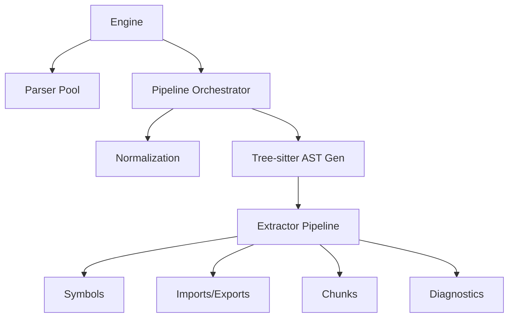
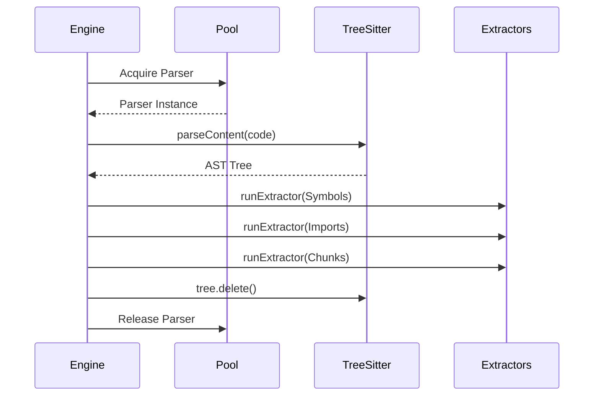

Relevant source files

The following files were used as context for generating this wiki page:

- [backend-worker/internal/parser/engine/engine.go](https://github.com/YannickTM/code-intelegence/blob/main/backend-worker/internal/parser/engine/engine.go)
- [backend-worker/internal/parser/extractors/chunks.go](https://github.com/YannickTM/code-intelegence/blob/main/backend-worker/internal/parser/extractors/chunks.go)
- [backend-worker/internal/parser/extractors/symbols.go](https://github.com/YannickTM/code-intelegence/blob/main/backend-worker/internal/parser/extractors/symbols.go)
- [backend-worker/internal/parser/extractors/diagnostics.go](https://github.com/YannickTM/code-intelegence/blob/main/backend-worker/internal/parser/extractors/diagnostics.go)
- [concept/tickets/backend-worker/05-parser-engine.md](https://github.com/YannickTM/code-intelegence/blob/main/concept/tickets/backend-worker/05-parser-engine.md)

# AST Extraction & Parser Engine

## Introduction

The **AST Extraction & Parser Engine** is the core analytical component of the project, responsible for transforming raw source code into structured, searchable data. It leverages Tree-sitter to generate Abstract Syntax Trees (ASTs) and executes a multi-tiered pipeline to extract symbols, imports, exports, and embedding-ready code chunks. The engine is designed to be stateless and highly concurrent, supporting over 25 languages with varying levels of extraction depth.

This system serves as the "brain" for the Code Intelligence Platform, providing the foundation for semantic search, dependency mapping, and automated code understanding. It ensures deterministic output through stable hashing and line-ending normalization, allowing for efficient incremental indexing and reliable retrieval across different platforms.
Sources: [concept/tickets/backend-worker/05-parser-engine.md]()

## Engine Architecture

The parser engine is structured around a central `Engine` struct that orchestrates the lifecycle of a parse request. It manages a bounded pool of Tree-sitter parsers to prevent resource exhaustion and provides a unified interface for batch processing.

The diagram above shows the high-level flow of data from the initial Engine request through the various extraction stages.
Sources: [concept/tickets/backend-worker/05-parser-engine.md]()

### Key Data Structures
The engine uses several configuration and result structures to manage state and output:

| Structure | Purpose | Key Fields |
|-----------|---------|------------|
| `EngineConfig` | Configuration for the engine instance | `PoolSize`, `TimeoutPerFile`, `MaxFileSize` |
| `ParsedFileResult` | Final output for a single source file | `Symbols`, `Imports`, `Chunks`, `Issues`, `Facts` |
| `FileFacts` | Boolean flags summarizing file characteristics | `HasJsx`, `HasTests`, `HasClassDeclarations` |
| `FileInput` | Input for a parse request | `FilePath`, `Content`, `Language` |

Sources: [concept/tickets/backend-worker/05-parser-engine.md]()

## The Parse Pipeline

The pipeline follows a strict, step-by-step sequence to ensure data integrity and error isolation. Each extractor is wrapped in a recovery layer to prevent a single failure from crashing the entire batch.

### Execution Flow
1. **Normalization**: Converts CRLF/CR to LF and strips the UTF-8 BOM.
2. **Pre-flight Checks**: Validates file size against `MaxFileSize` and checks if the content is empty.
3. **Language Detection**: Identifies the language based on file extension if not explicitly provided.
4. **AST Generation**: Acquires a parser from the pool and generates a Tree-sitter `Tree`.
5. **Extraction**: Runs a series of extractors (Symbols, Imports, Chunks, etc.) based on the language's assigned "Tier".
6. **Cleanup**: Explicitly deletes the Tree to free WASM/Native memory.

This sequence ensures that memory is managed correctly and parsers are returned to the pool even if extraction fails.
Sources: [concept/tickets/backend-worker/05-parser-engine.md]()

## Extraction Tiers

The engine categorizes supported languages into three tiers, which determine the depth of analysis performed.

*   **Tier 1 (Full)**: Includes symbols, imports, exports, references, chunks, and diagnostics. (e.g., TS, JS, Python, Go, Rust).
*   **Tier 2 (Partial)**: Symbols, imports, chunks, and diagnostics. (e.g., Bash, SQL, Dockerfile).
*   **Tier 3 (Structural)**: Chunks and diagnostics only. Used for data/markup languages like JSON, YAML, and HTML.

Sources: [concept/tickets/backend-worker/08-extractors-chunks-diagnostics.md]()

## Extraction Modules

### Symbol Extraction
The symbols extractor walks the AST to find declarations such as functions, classes, methods, and interfaces. It handles complex patterns like arrow function assignments and JSDoc attachment.
*   **IDs**: `symbol_id` is a deterministic hash of `kind:name:startLine`.
*   **Nesting**: Recursively processes namespaces and classes to generate qualified names (e.g., `Namespace.Class.method`).
Sources: [backend-worker/internal/parser/extractors/symbols.go]()

### Chunk Generation
The chunker creates embedding-ready units of code. It prioritizes non-overlapping chunks to ensure search precision.
*   **MODULE_CONTEXT**: Captures the file preamble (imports, constants, types) from line 1 to the first major declaration.
*   **FUNCTION**: Full source of a function, including doc comments.
*   **CLASS**: Small classes are included in full; large classes (>200 lines) are summarized with signatures and constructors.
*   **CONFIG/TEST**: Specialized chunking for configuration and test files based on regex patterns.
Sources: [backend-worker/internal/parser/extractors/chunks.go](), [concept/tickets/backend-worker/08-extractors-chunks-diagnostics.md]()

### Diagnostics and Error Surface
The diagnostics module identifies syntax errors (`ERROR` or `MISSING` nodes in the AST) and structural warnings.
*   **Structural Warnings**: Flags `LONG_FUNCTION` (>200 lines), `LONG_FILE` (>1000 lines), and `DEEP_NESTING` (>6 levels).
*   **Error Merging**: Consecutive errors on the same line are merged to reduce noise.
Sources: [backend-worker/internal/parser/extractors/diagnostics.go]()

## Determinism and Hashing

The engine ensures that the same source code always produces the same output IDs and hashes. This is critical for the project's incremental indexing strategy.
*   **Stable Hash**: Uses SHA-256 to generate `file_hash`, `symbol_hash`, and `chunk_hash`.
*   **Deterministic IDs**: Chunk and symbol IDs are derived from a combination of file path, type, and start line, ensuring stability across index runs.
Sources: [backend-worker/internal/parser/consistency_test.go]()

## Conclusion
The AST Extraction & Parser Engine provides a robust, multi-language foundation for code analysis. By combining the precision of Tree-sitter with a structured extraction pipeline and tiered language support, it enables the system to maintain a deep, searchable understanding of complex codebases. Its emphasis on determinism and error isolation makes it suitable for large-scale, automated indexing workflows.
