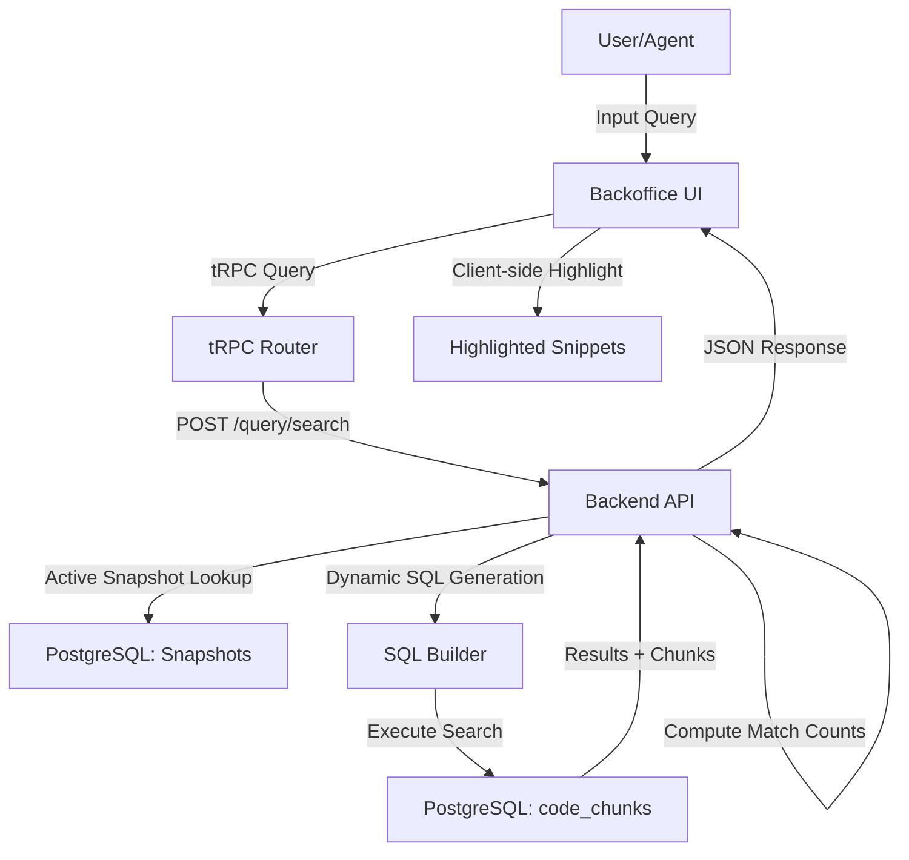
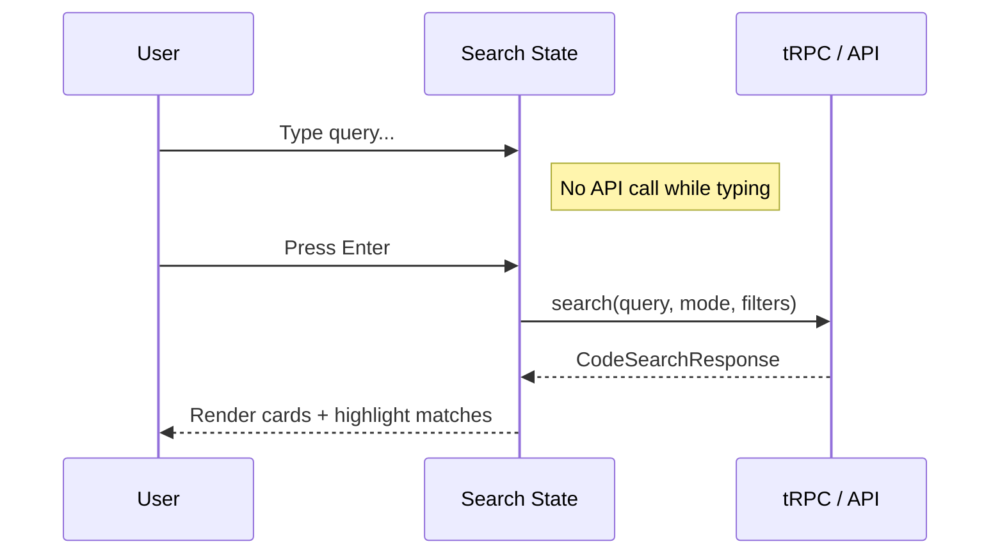

<details>
<summary>Relevant source files</summary>

The following files were used as context for generating this wiki page:

- [concept/tickets/backend-api/11-code-search.md](https://github.com/YannickTM/code-intelegence/blob/main/concept/tickets/backend-api/11-code-search.md)
- [concept/tickets/backoffice/07-code-search.md](https://github.com/YannickTM/code-intelegence/blob/main/concept/tickets/backoffice/07-code-search.md)
- [concept/tickets/backoffice/08-symbol-browser.md](https://github.com/YannickTM/code-intelegence/blob/main/concept/tickets/backoffice/08-symbol-browser.md)
- [concept/tickets/backend-worker/10-full-index.md](https://github.com/YannickTM/code-intelegence/blob/main/concept/tickets/backend-worker/10-full-index.md)
- [concept/tickets/backoffice/09-file-browser.md](https://github.com/YannickTM/code-intelegence/blob/main/concept/tickets/backoffice/09-file-browser.md)
- [concept/tickets/backend-api/12-symbol-query.md](https://github.com/YannickTM/code-intelegence/blob/main/concept/tickets/backend-api/12-symbol-query.md)
</details>

# Full-Text Codebase Search

Full-Text Codebase Search is a core feature of the MYJUNGLE platform that provides VS Code-like search capabilities across indexed code content. It allows users and AI agents to perform high-performance text matching using multiple search modes, including case-insensitive, case-sensitive, and regular expressions. The system leverages a dynamic SQL builder to query pre-indexed `code_chunks` stored in a PostgreSQL database, providing results with match highlighting and rich metadata.

The search functionality is accessible via the Backoffice UI and exposed to external agents through the Model Context Protocol (MCP) interface. It is designed to handle complex queries across large repositories by combining text patterns with filters for programming languages, file patterns, and directory scopes.

Sources: [concept/tickets/backoffice/07-code-search.md](), [concept/tickets/backend-api/11-code-search.md]()

## System Architecture and Data Flow

The codebase search architecture involves a multi-layer flow starting from the Backoffice UI (or MCP server), moving through the Backend API for query construction, and finally retrieving data from the PostgreSQL relational database.

### Search Execution Flow
When a user submits a query, the Backoffice UI triggers a tRPC procedure which calls the Backend API's search endpoint. The Backend API uses a dynamic SQL builder to construct a query against the `code_chunks` and `files` tables.


The search is specifically targeted at the `active` snapshot of a project to ensure results reflect the most recent indexed state of the codebase.
Sources: [concept/tickets/backend-api/11-code-search.md](), [concept/tickets/backoffice/07-code-search.md]()

## Search Capabilities and Configuration

The system supports granular search controls that mirror standard IDE behaviors. Users can toggle between three primary search modes and apply various filters to narrow the search scope.

### Search Modes
The platform provides three distinct matching behaviors implemented through PostgreSQL operators.

| Mode | Backend Operator | Description |
| :--- | :--- | :--- |
| **Insensitive** | `ILIKE` | Case-insensitive substring matching (Default). |
| **Sensitive** | `LIKE` | Case-sensitive substring matching. |
| **Regex** | `~` | POSIX regular expression matching. |

Sources: [concept/tickets/backend-api/11-code-search.md](), [concept/tickets/backoffice/07-code-search.md]()

### Advanced Filters
Filters are combined using `AND` logic to refine results.

*   **Language Filter:** Limits results to specific programming languages (e.g., `go`, `typescript`) based on the `files.language` column.
*   **File Pattern:** Supports comma-separated glob patterns (e.g., `*.go`, `**/*.test.ts`) that are converted to regex for matching against `file_path`.
*   **Directory Inclusion/Exclusion:** Uses `include_dir` and `exclude_dir` to scope the search to specific paths or omit vendor/test directories.

Sources: [concept/tickets/backend-api/11-code-search.md](), [concept/tickets/backoffice/07-code-search.md]()

## Backend Implementation

The backend implementation centers on `HandleSearch` in the `ProjectHandler` and a specialized `buildCodeSearchQuery` function.

### Dynamic SQL Builder
The system constructs two separate SQL queries for every search request: one for the paginated data and one for the total count. This ensures consistent filtering across the result set and the pagination metadata.

```go
// Example logic from buildCodeSearchQuery
where = append(where, fmt.Sprintf("c.project_id = %s", arg(p.ProjectID)))
where = append(where, fmt.Sprintf("c.index_snapshot_id = %s", arg(p.IndexSnapshotID)))

switch p.SearchMode {
case searchModeInsensitive:
    likePattern := "%" + p.Query + "%"
    where = append(where, fmt.Sprintf("c.content ILIKE %s", arg(likePattern)))
case searchModeRegex:
    // Validation performed in Go before SQL execution
    where = append(where, fmt.Sprintf("c.content ~ %s", arg(p.Query)))
}
```
Sources: [concept/tickets/backend-api/11-code-search.md]()

### Match Counting
While the database handles the filtering, the Backend API performs an additional pass in Go to count the exact number of occurrences within each returned chunk before sending the response to the client.
Sources: [concept/tickets/backend-api/11-code-search.md]()

## Frontend Presentation

The Backoffice UI presents search results as a vertical list of code snippet cards. This layout provides sufficient horizontal space for code readability compared to standard tables.

### Result Visualization
Each result card displays the file path, the language, and a code block with line numbers.
*   **Highlighting:** Computed client-side to avoid API bloat. It uses the query and search mode to wrap matches in `<mark>` elements.
*   **Navigation:** Clicking the file path or "View File" navigates the user to the [Code File Viewer](#code-file-viewer) at the specific starting line of the match.

### Interface State Management
The UI uses `useDebounce` for secondary filters (file patterns, directories) but requires an explicit "Enter" or submit click for the main search query to prevent excessive API calls with partial regex patterns.


Sources: [concept/tickets/backoffice/07-code-search.md](), [concept/tickets/backoffice/07-code-search.md]()

## Data Models

The following table summarizes the data structure for codebase search results as defined in the API.

| Field | Type | Description |
| :--- | :--- | :--- |
| `chunk_id` | `string (UUID)` | Unique identifier for the code chunk. |
| `file_path` | `string` | The path of the file containing the match. |
| `language` | `string` | Programming language of the file. |
| `start_line` | `int32` | Starting line number of the chunk in the source file. |
| `content` | `string` | The full text content of the code chunk. |
| `match_count`| `int` | Number of occurrences of the search term in this chunk. |

Sources: [concept/tickets/backend-api/11-code-search.md](), [concept/tickets/backoffice/07-code-search.md]()

## Conclusion

Full-Text Codebase Search provides a robust mechanism for exploring repository content within MYJUNGLE. By utilizing PostgreSQL's native text matching capabilities and a dynamic query builder, the system offers high performance and flexibility. The separation of concerns—where the backend handles retrieval and match counting while the frontend manages highlighting—ensures a responsive and scalable search experience for both human users and AI agents.
