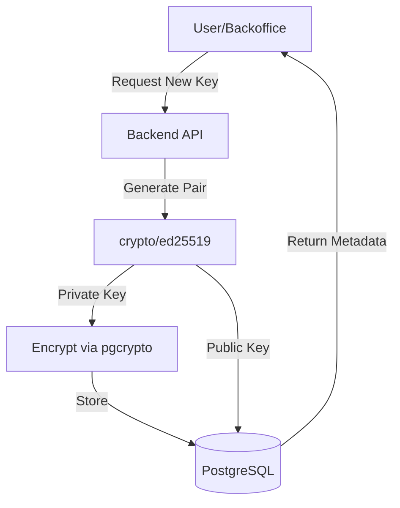
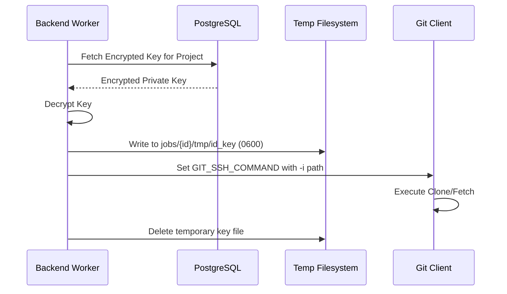
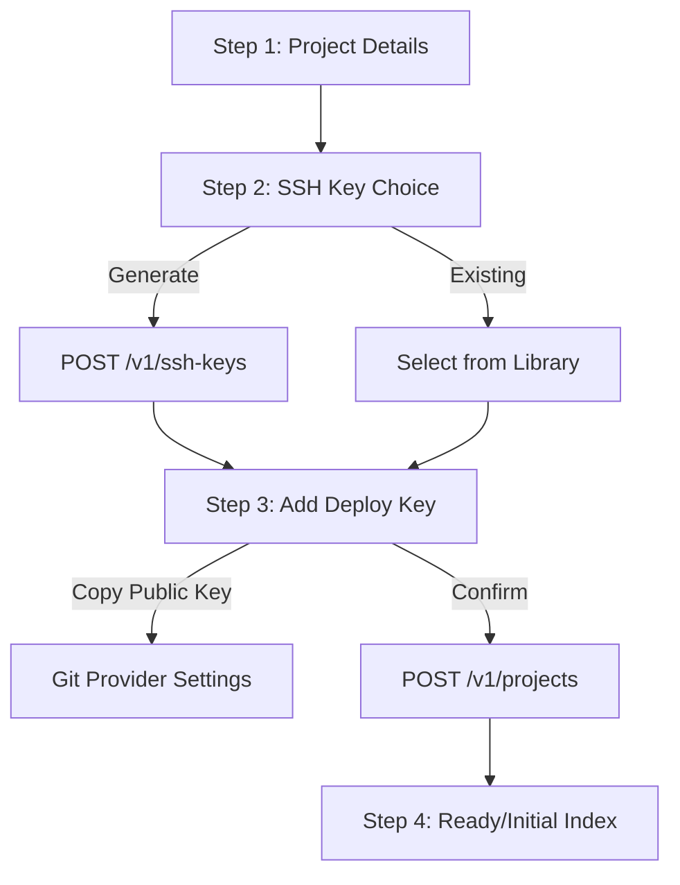

Relevant source files

The following files were used as context for generating this wiki page:

- [concept/tickets/backend-worker/04-workspace.md](https://github.com/YannickTM/code-intelegence/blob/main/concept/tickets/backend-worker/04-workspace.md)
- [concept/tickets/backend-api/04-project-lifecycle.md](https://github.com/YannickTM/code-intelegence/blob/main/concept/tickets/backend-api/04-project-lifecycle.md)
- [concept/04-backend-service.md](https://github.com/YannickTM/code-intelegence/blob/main/concept/04-backend-service.md)
- [concept/tickets/backoffice/03-projects.md](https://github.com/YannickTM/code-intelegence/blob/main/concept/tickets/backoffice/03-projects.md)
- [concept/tickets/backoffice/04-project-members-ssh.md](https://github.com/YannickTM/code-intelegence/blob/main/concept/tickets/backoffice/04-project-members-ssh.md)

# Git Credentials & SSH Key Management

## Introduction
The Git Credentials & SSH Key Management system is a core infrastructure component of the MYJUNGLE platform, designed to provide secure, persistent, and automated access to private Git repositories. The system centers on a reusable SSH key library where users can generate or import Ed25519 key pairs. These keys are then assigned to specific projects to facilitate repository indexing and maintenance.

By separating key management from project configuration, the system allows a single deploy key to be shared across multiple repositories while maintaining strict access controls. Private keys are encrypted at rest using `pgcrypto` and are only decrypted within isolated worker environments during Git operations.
Sources: [concept/04-backend-service.md:105-112]()

## SSH Key Lifecycle & Architecture
The architecture follows a "Library-Assignment" model. Users maintain a private library of SSH keys, which are then linked to projects through an assignment table. This allows for flexible key rotation and reuse.

### Key Generation and Storage
SSH keys are primarily generated using Go's `crypto/ed25519` package. When a key is created, the system generates a public/private key pair, computes a fingerprint (SHA256), and encrypts the private key before persisting it to the PostgreSQL database.

The system supports both internal generation and importing of existing unencrypted PEM-encoded private keys.
Sources: [concept/04-backend-service.md:114-123](), [concept/tickets/backoffice/04-project-members-ssh.md]()

### Key Assignment Logic
A project cannot exist without an active SSH key assignment. During project creation, a user must either select an existing key from their library or generate a new one.

| Action | Logic |
| :--- | :--- |
| **Initial Assignment** | Occurs during `POST /v1/projects`. Validates key exists and belongs to the creator. |
| **Reassignment** | `PUT /v1/projects/{id}/ssh-key`. Deactivates current assignment and creates a new active one. |
| **Removal** | `DELETE /v1/projects/{id}/ssh-key`. Deactivates assignment; blocks Git operations until a new key is assigned. |
| **Retirement** | `POST /v1/ssh-keys/{id}/retire`. Marks key inactive. Blocked if the key is still assigned to active projects. |

Sources: [concept/tickets/backend-api/04-project-lifecycle.md](), [concept/tickets/backoffice/04-project-members-ssh.md]()

## Git Execution Environment
When the `backend-worker` performs Git operations (clone, fetch, or pull), it establishes a temporary, secure execution environment using the assigned SSH key.

### Secure Key Handling
To prevent key leakage, the worker follows a strict temporary file protocol:
1. **Decryption**: The private key is decrypted within the job execution context.
2. **Isolation**: The key is written to a job-scoped temporary file (e.g., `jobs/{job_id}/tmp/id_key`).
3. **Permissions**: The file is strictly set to `0600` permissions.
4. **Environment Injection**: The `GIT_SSH_COMMAND` environment variable is set to point Git to the specific temporary key file.
5. **Cleanup**: The temporary key file is deleted immediately after the workflow exits, regardless of success or failure.

Sources: [concept/tickets/backend-worker/04-workspace.md](), [concept/04-backend-service.md:144-152]()

### Host Key Verification
The system does not disable global host key checking. Instead, it maintains a worker-managed `known_hosts` file. The worker uses `ssh-keyscan` to populate this file for the target host extracted from the `projects.repo_url` before initiating Git commands.
Sources: [concept/tickets/backend-worker/04-workspace.md]()

## API Reference & Data Structures

### SSH Key Object Model
The system represents keys through the `SSHKey` domain model, which includes both the public material and metadata for tracking usage and status.

| Field | Type | Description |
| :--- | :--- | :--- |
| `id` | UUID | Unique identifier for the key record. |
| `name` | String | User-defined label for the key. |
| `fingerprint` | String | SHA256 fingerprint of the public key. |
| `public_key` | String | OpenSSH authorized_keys format string. |
| `is_active` | Boolean | Whether the key is available for project assignments. |
| `created_by` | UUID | The user who owns the key in their private library. |

Sources: [concept/tickets/backoffice/04-project-members-ssh.md](), [concept/04-backend-service.md:114-123]()

### Project-SSH Endpoints
These endpoints manage the relationship between projects and credentials.

| Method | Endpoint | Description | Role Required |
| :--- | :--- | :--- | :--- |
| `GET` | `/v1/projects/{id}/ssh-key` | View public key and fingerprint. | Member |
| `PUT` | `/v1/projects/{id}/ssh-key` | Reassign or generate/assign a new key. | Admin/Owner |
| `DELETE` | `/v1/projects/{id}/ssh-key` | Remove the active key assignment. | Admin/Owner |

Sources: [concept/tickets/backend-api/04-project-lifecycle.md](), [concept/04-backend-service.md:175-182]()

## Implementation Flows

### Create Project Assistant
The backoffice provides a guided multi-step assistant to ensure SSH keys are correctly configured during project setup.

The project is only created at Step 3 once the `ssh_key_id` is secured. This ensures no project exists without valid authentication credentials.
Sources: [concept/tickets/backoffice/03-projects.md](), [concept/tickets/backoffice/03-projects.md]()

## Conclusion
The Git Credentials & SSH Key Management system provides a robust security layer for the MYJUNGLE platform. By leveraging per-user key libraries and project-scoped assignments, it enables scalable management of Git access. The architecture ensures that private key material is never exposed via the API and is handled with maximum isolation during the indexing process, using job-scoped temporary files and strict file permissions.
