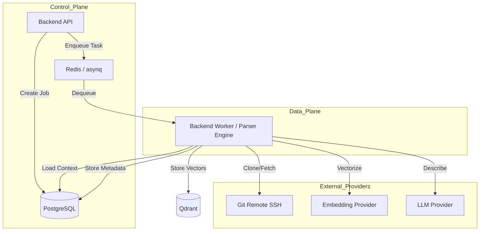
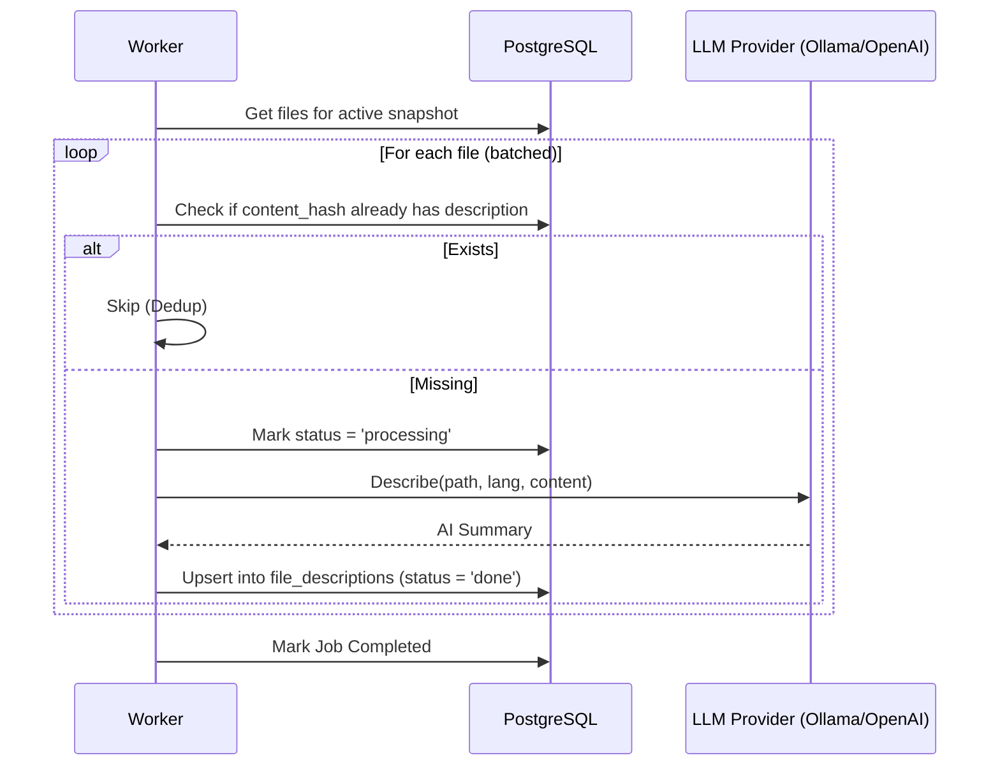

Relevant source files

The following files were used as context for generating this wiki page:

- [concept/tickets/backend-worker/10-full-index.md](https://github.com/YannickTM/code-intelegence/blob/main/concept/tickets/backend-worker/10-full-index.md)
- [concept/tickets/backend-worker/09-pipeline.md](https://github.com/YannickTM/code-intelegence/blob/main/concept/tickets/backend-worker/09-pipeline.md)
- [README.md](https://github.com/YannickTM/code-intelegence/blob/main/README.md)

# Persistent Code Indexing Pipeline

## Introduction

The Persistent Code Indexing Pipeline is the core data processing engine of the MYJUNGLE platform. Its primary purpose is to transform raw source code from remote Git repositories into a structured, searchable knowledge base for AI coding agents. The pipeline handles multi-project isolation, performing initial "full" indexes and subsequent incremental updates to keep the code intelligence fresh. By extracting Abstract Syntax Tree (AST) data, generating semantic embeddings, and producing AI-summarized descriptions, the pipeline enables high-quality context retrieval via the Model Context Protocol (MCP).

The pipeline operates as a distributed system where a Go-based `backend-worker` executes intensive tasks, including in-process language parsing through its embedded Tree-sitter engine. Results are persisted across PostgreSQL for relational metadata and Qdrant for vector-based semantic search, ensuring that AI agents can query a persistent memory of the codebase rather than re-analyzing it on every session.

Sources: [README.md:3-15](), [concept/tickets/backend-worker/10-full-index.md]()

## Pipeline Architecture and Workflow

The indexing pipeline follows a modular "Data Plane" architecture. Workflows are triggered by the Backend API, which enqueues small task messages into Redis/asynq. The `backend-worker` dequeues these tasks, loads the full execution context (including secrets and configurations) from PostgreSQL, and executes the multi-stage indexing process.

### High-Level Component Interaction
The diagram below illustrates how the worker coordinates with external providers and internal databases during an indexing run.

Sources: [README.md:21-35](), [concept/tickets/backend-worker/10-full-index.md]()

## Full-Index Execution Logic

The `full-index` workflow is the primary mechanism for onboarding a new project or branch. It establishes the baseline snapshot used for all subsequent incremental updates.

### Sequential Processing Stages
1.  **Job Claiming**: The worker marks the `indexing_job` as "running" and sets the `started_at` timestamp.
2.  **Workspace Preparation**: The worker resolves the active SSH key, decrypts it, and performs a clone or fetch of the repository, checking out the `default_branch`.
3.  **File Enumeration**: Lists all tracked files via `git ls-files`. Files are filtered by size (typically < 1MB) and categorized into parser-supported (Tier 1/2) or structural/raw files.
4.  **Parsing & Extraction**: Parser-supported files are parsed in-process by the `backend-worker` using the embedded parser engine, which returns symbols, imports, and code chunks.
5.  **Persistence & Vectorization**:
    *   **PostgreSQL**: Upserts `file_contents` (deduplicated by hash), `files`, `symbols`, and `code_chunks`.
    *   **Qdrant**: Generates embeddings via a provider (e.g., Ollama) and upserts vectors into specific collections.
6.  **Snapshot Activation**: Atomically swaps the active snapshot for the project upon successful completion.

Sources: [concept/tickets/backend-worker/10-full-index.md]()

## Embedded Parser Engine

The pipeline uses an in-process parser engine inside `backend-worker` to handle Tree-sitter based parsing and extraction across supported languages.

### Extraction Pipeline Detail
The parser engine processes each file through a strict internal pipeline to ensure deterministic output:

| Stage | Activity | Logic / Threshold |
| :--- | :--- | :--- |
| **Normalization** | Content cleaning | CRLF to LF conversion; BOM stripping. |
| **Metadata** | Hashing | SHA-256 hash of normalized content. |
| **Size Guard** | Validation | Rejects files larger than `maxFileSizeBytes` (default 10MB). |
| **Symbols** | AST Analysis | Extracts classes, functions, interfaces, and variables. |
| **Imports** | Dependency Mapping | Classifies imports as INTERNAL, EXTERNAL, or STDLIB. |
| **Chunks** | Retrieval Preparation | Segments file into `module_context`, `class`, and `function` chunks. |
| **Diagnostics** | Error Reporting | Captures Tree-sitter `ERROR` nodes and structural warnings (e.g., `LONG_FUNCTION`). |

### Chunking Strategy
Chunks are designed for optimal LLM retrieval. For normal files, the parser engine creates a `MODULE_CONTEXT` chunk covering imports and top-level constants, followed by individual chunks for functions and classes. Large classes (>200 lines) are summarized, providing a declaration signature while referring to individual method chunks for detail.

## LLM File Description Pipeline

A secondary workflow, `describe-files`, enriches the index with human-readable summaries. This pipeline is non-fatal; the failure of a single file to generate a description does not fail the entire indexing job.

Sources: [concept/tickets/backend-worker/09-pipeline.md]()

## Data Persistence Model

The pipeline maintains a strict relational schema to support incremental updates and snapshot management.

### Key Data Structures
*   **Indexing Jobs**: Tracks the lifecycle of a pipeline run (`queued`, `running`, `completed`, `failed`).
*   **Index Snapshots**: A versioned collection of indexed artifacts tied to a specific Git commit.
*   **File Contents**: Content-addressable storage that deduplicates identical file contents across the entire system.
*   **File Descriptions**: AI-generated metadata keyed by `(project_id, content_hash)` to ensure descriptions are reused if file content hasn't changed.

Sources: [concept/tickets/backend-worker/10-full-index.md](), [concept/tickets/backend-worker/09-pipeline.md]()

## Summary

The Persistent Code Indexing Pipeline provides the foundational intelligence for the MYJUNGLE platform. By combining high-performance Git workspace management, AST-based symbol extraction inside `backend-worker`, and AI-driven enrichment, it creates a durable and context-rich representation of source code. This architecture ensures that agents have access to structured relationships (symbols and imports), semantic search (embeddings), and human-readable summaries (file descriptions), all while maintaining strict project isolation and incremental efficiency.
