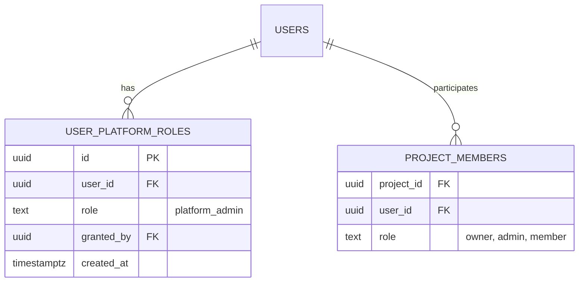
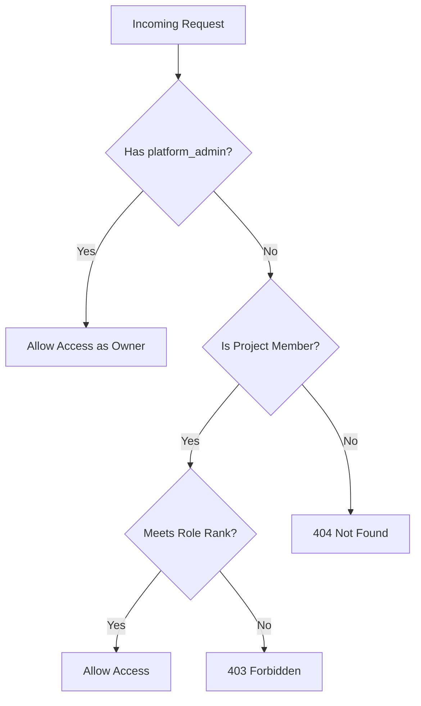
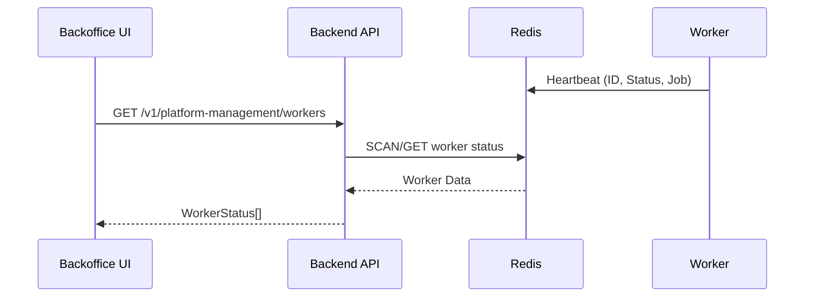
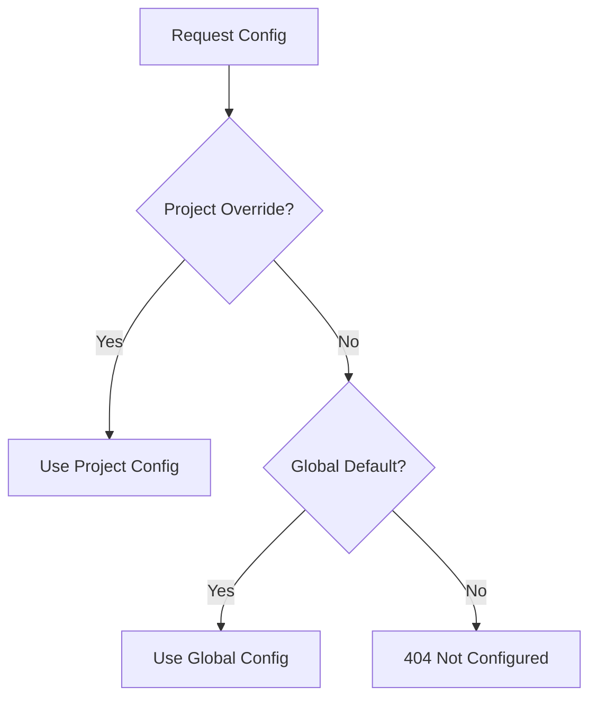

Relevant source files

The following files were used as context for generating this wiki page:

- [concept/tickets/backend-api/15-platform-admin.md](https://github.com/YannickTM/code-intelegence/blob/main/concept/tickets/backend-api/15-platform-admin.md)
- [concept/08-platform-admin.md](https://github.com/YannickTM/code-intelegence/blob/main/concept/08-platform-admin.md)
- [concept/tickets/backoffice/14-platform-admin.md](https://github.com/YannickTM/code-intelegence/blob/main/concept/tickets/backoffice/14-platform-admin.md)
- [datastore/postgres/queries/admin_users.sql](https://github.com/YannickTM/code-intelegence/blob/main/datastore/postgres/queries/admin_users.sql)
- [datastore/postgres/queries/platform_roles.sql](https://github.com/YannickTM/code-intelegence/blob/main/datastore/postgres/queries/platform_roles.sql)
- [concept/tickets/backoffice/14-platform-admin.md](https://github.com/YannickTM/code-intelegence/blob/main/concept/tickets/backoffice/14-platform-admin.md)

# Platform Users & Administration

## Introduction

The Platform Users & Administration system provides a centralized administrative layer for managing the MYJUNGLE code intelligence platform. It introduces the `platform_admin` role, which grants elevated, system-level permissions separate from project-specific roles (Owner, Admin, Member). This system enables cross-project oversight, global user management, and server-wide configuration management.

The primary goal of this module is to provide platform administrators with the tools necessary to monitor system health, manage user accounts, and ensure operational continuity across all hosted projects. It includes a dedicated Backoffice UI for managing users, roles, and worker statuses, supported by a robust set of backend API endpoints and database schemas.
Sources: [concept/08-platform-admin.md:1-12](), [concept/tickets/backend-api/15-platform-admin.md]()

## Role Model and Authorization

The platform implements a tiered authorization model. While project-scoped roles manage repository-level access, the `platform_admin` role provides global authority. A `platform_admin` is treated as an "Owner" for any project-scoped route through a middleware short-circuit.
Sources: [concept/08-platform-admin.md:14-25](), [concept/tickets/backend-api/15-platform-admin.md]()

### Platform Roles Architecture
Platform roles are stored in a dedicated `user_platform_roles` table. This design supports future extensibility for other system-level roles such as `platform_viewer`.
Sources: [concept/08-platform-admin.md:27-41](), [concept/tickets/backend-api/15-platform-admin.md]()

The diagram shows the relationship between users, their platform-wide roles, and their specific project memberships.
Sources: [concept/08-platform-admin.md:31-40](), [concept/tickets/backend-api/15-platform-admin.md]()

### Authorization Flow
Authorization is resolved by checking the platform role first, then falling back to project membership.
Sources: [concept/08-platform-admin.md:44-50](), [concept/tickets/backend-api/15-platform-admin.md]()

This flowchart illustrates the short-circuit logic where platform admins bypass standard project membership checks.
Sources: [concept/08-platform-admin.md:44-50](), [concept/tickets/backend-api/15-platform-admin.md]()

## User Management

Platform administrators can perform oversight on all platform users through the `/platform-settings/users` view. This includes searching, filtering, and modifying account statuses.
Sources: [concept/tickets/backoffice/14-platform-admin.md](), [concept/08-platform-admin.md:52-58]()

### Admin Actions and Safety Invariants
To prevent system lockout, the system enforces "Last Admin" and "Self-Action" protections.
- **Self-Action Protection**: Admins cannot deactivate themselves or revoke their own `platform_admin` role.
- **Last Admin Protection**: The backend rejects (409 Conflict) any attempt to deactivate or revoke the role of the final active platform administrator.
Sources: [concept/tickets/backoffice/14-platform-admin.md](), [concept/tickets/backend-api/15-platform-admin.md]()

### API Endpoints: User Administration
| Method | Path | Description |
| :--- | :--- | :--- |
| `GET` | `/v1/platform-management/users` | Paginated list of users with search/filter. |
| `GET` | `/v1/platform-management/users/{id}` | Detailed user profile including all memberships. |
| `PATCH` | `/v1/platform-management/users/{id}` | Update display name or avatar. |
| `POST` | `/v1/platform-management/users/{id}/deactivate` | Soft-disable account and kill active sessions. |
| `POST` | `/v1/platform-management/users/{id}/activate` | Re-enable a deactivated account. |
Sources: [concept/tickets/backend-api/15-platform-admin.md](), [concept/08-platform-admin.md:60-70]()

## Platform Monitoring and Status

Administration includes real-time observability into system components, specifically the background workers that handle indexing and analysis tasks.
Sources: [concept/tickets/backoffice/14-platform-admin.md]()

### Worker Status Tracking
Workers send heartbeats to Redis, which the API exposes via the `platformWorkers.list` procedure. This allows admins to monitor worker health and current job assignments.
Sources: [concept/tickets/backoffice/14-platform-admin.md]()

This sequence shows how worker status is aggregated from Redis and presented to the administrator.
Sources: [concept/tickets/backoffice/14-platform-admin.md](), [README.md:31-41]()

### Worker States
Workers can exist in several states, visually represented in the UI by color-coded badges:
- **Starting (Yellow)**: Initializing.
- **Idle (Green)**: Ready for tasks.
- **Busy (Blue)**: Currently processing a job.
- **Draining (Orange)**: Finishing current job before shutdown.
- **Stopped (Gray)**: Offline or shutting down.
Sources: [concept/tickets/backoffice/14-platform-admin.md]()

## Server-Wide Settings

Platform admins manage global defaults using a **Two-Tier Settings Pattern**. Settings such as embedding configurations resolve from project-specific overrides down to global platform defaults.
Sources: [concept/08-platform-admin.md:148-155](), [concept/tickets/backend-api/15-platform-admin.md]()

### Settings Resolution Logic

The resolution order ensures flexibility for individual projects while maintaining sane defaults.
Sources: [concept/08-platform-admin.md:150-153](), [concept/tickets/backend-api/15-platform-admin.md]()

## Conclusion

Platform Users & Administration serves as the operational backbone for MYJUNGLE. By separating platform-level management from project-specific workflows, it provides administrators with global visibility and control without complicating the day-to-day experience of project members. Through robust safety checks, comprehensive monitoring of workers, and a two-tier configuration model, the system ensures the platform remains secure and stable as repository counts and user numbers grow.
