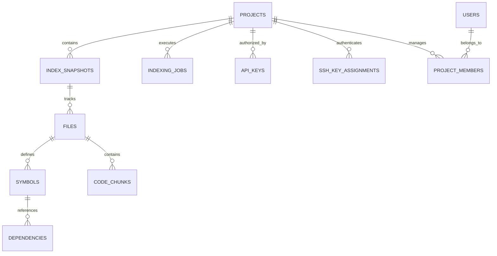
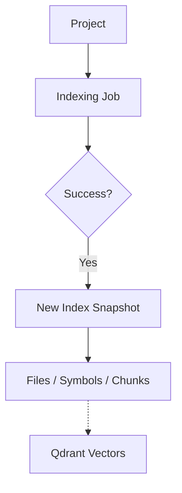

<details>
<summary>Relevant source files</summary>

The following files were used as context for generating this wiki page:

- [datastore/POSTGRES.md](https://github.com/YannickTM/code-intelegence/blob/main/datastore/POSTGRES.md)
- [concept/03-relational-db.md](https://github.com/YannickTM/code-intelegence/blob/main/concept/03-relational-db.md)
- [datastore/POSTGRES.md](https://github.com/YannickTM/code-intelegence/blob/main/datastore/POSTGRES.md)
- [concept/tickets/backend-api/01-foundation.md](https://github.com/YannickTM/code-intelegence/blob/main/concept/tickets/backend-api/01-foundation.md)
</details>

# PostgreSQL Schema & Relationships

PostgreSQL serves as the primary source of truth for all structured metadata, indexing lifecycles, and access control within the MYJUNGLE project. While vector databases like Qdrant handle semantic similarity, PostgreSQL answers the structural questions: "What exists, how is it related, and what state is it in?"

The database handles project configurations, SSH key management, API key authorization, and the versioned snapshots of indexed artifacts such as files, symbols, and dependencies. It is essential for maintaining deterministic relationships that the vector space cannot represent.

Sources: [datastore/POSTGRES.md:3-10]()

## Entity Relationship Overview

The schema is architected around a central `projects` table which owns almost all other entities. Relationships are structured to support multi-tenancy and versioned indexing snapshots.


The diagram above illustrates the ownership hierarchy where projects serve as the root container for all code-related artifacts and security configurations.
Sources: [concept/03-relational-db.md:434-445]()

## Core Data Domains

### Project & Identity Management
Projects represent the primary unit of isolation. Access is governed by `users` and `project_members`, which implement a project-scoped Role-Based Access Control (RBAC) model with roles like `owner`, `admin`, and `member`.

| Table | Description |
| :--- | :--- |
| `users` | Stores identity metadata including usernames and display names. |
| `projects` | Root entity containing repository URLs and status. |
| `project_members` | Join table mapping users to projects with specific roles. |
| `project_groups` | Optional organizational layer for grouping multiple projects. |

Sources: [concept/03-relational-db.md:35-80](), [datastore/POSTGRES.md:19-23]()

### Indexing Lifecycle & Versioning
To ensure data integrity during model or code changes, indexing is scoped to `index_snapshots`. Every artifact (file, symbol, chunk) is bound to a specific snapshot ID, preventing cross-snapshot blending in query responses.


Indexing jobs track the progress of ingestion (full or incremental), while `embedding_versions` ensure that snapshots are tied to the exact model configuration used during vectorization.
Sources: [concept/03-relational-db.md:170-220]()

### Security & Authentication
The system manages two distinct types of credentials: Git authentication and API authorization.

#### SSH Key Library
SSH keys are managed as a per-user library. Private keys are encrypted at rest using `pgcrypto`. Projects reference these via `project_ssh_key_assignments`, allowing one key to be shared across multiple projects.
Sources: [concept/03-relational-db.md:90-135](), [datastore/POSTGRES.md:25-30]()

#### API Key Access Model
API keys are categorized into `project` keys (scoped to one project) and `personal` keys (dynamic access based on user membership).

```sql
CREATE VIEW api_key_project_access AS
SELECT ak.id AS api_key_id, ak.key_prefix, ak.key_hash, ak.key_type,
       pm.project_id, ak.created_by,
       -- Role mapping: owner -> admin, admin -> write, member -> read
       CASE ... END AS effective_role
FROM api_keys ak
JOIN project_members pm ON pm.user_id = ak.created_by;
```
Access checks are performed against the `api_key_project_access` view, which unifies both key types for the backend API.
Sources: [concept/03-relational-db.md:313-360](), [datastore/POSTGRES.md:52-56]()

## Artifact Storage
The database stores detailed structural information about the codebase.

| Entity | Fields | Constraints |
| :--- | :--- | :--- |
| `files` | `file_path`, `file_hash`, `size_bytes` | Unique per `(project_id, snapshot_id, file_path)` |
| `symbols` | `name`, `kind`, `start_line`, `end_line` | References `file_id` and `parent_symbol_id` |
| `code_chunks` | `content`, `chunk_type`, `raw_text_ref` | References `file_id`; source for Qdrant payloads |
| `dependencies` | `source_file_path`, `import_name`, `import_type` | Links symbols across files and external packages |

Sources: [concept/03-relational-db.md:225-305](), [datastore/POSTGRES.md:40-44]()

## Technical Implementation
The project utilizes `golang-migrate` for versioned SQL migrations and `sqlc` for generating type-safe Go code from SQL queries.

*   **Extensions**: `pgcrypto` is mandatory for UUID generation and SSH key encryption.
*   **Connection**: Handled via `pgxpool` with configurable limits for concurrency and connection lifetimes.
*   **Retention**: A 30-day window is maintained for the `query_log`, while superseded snapshots are kept for a configurable grace period to allow rollbacks.

Sources: [concept/tickets/backend-api/01-foundation.md](), [datastore/POSTGRES.md](), [datastore/POSTGRES.md:58-65]()

## Summary
The PostgreSQL schema provides the structural backbone of the intelligence platform. By organizing data into projects and snapshots, it ensures isolation and version consistency. The integration of encrypted SSH keys and dynamic API key mapping allows for secure, multi-tenant operations while maintaining a high-fidelity representation of the indexed source code.
