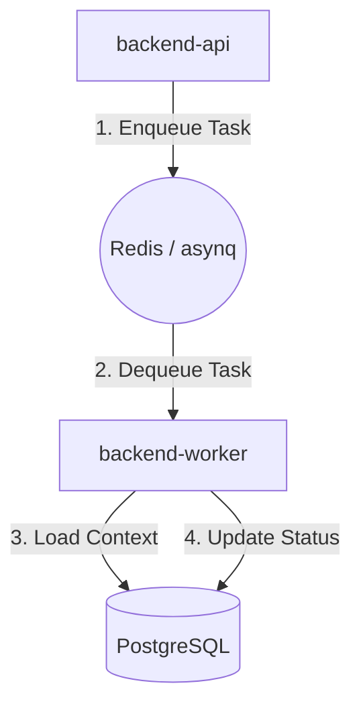
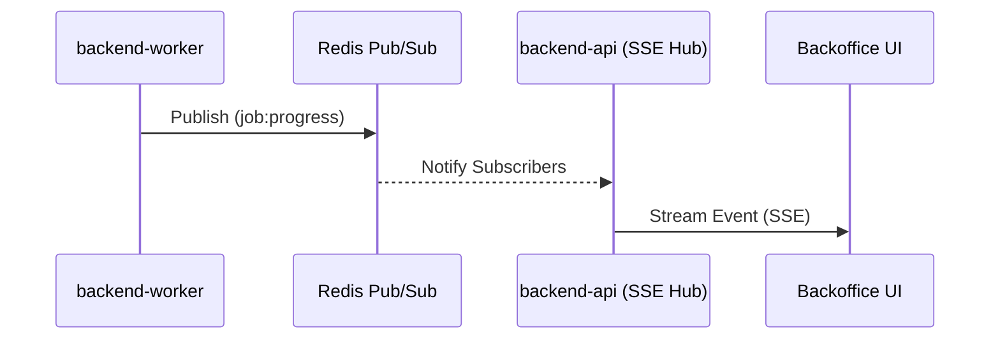

<details>
<summary>Relevant source files</summary>

The following files were used as context for generating this wiki page:

- [datastore/REDIS.md](https://github.com/YannickTM/code-intelegence/blob/main/datastore/REDIS.md)
- [backend-api/internal/queue/publisher.go](https://github.com/YannickTM/code-intelegence/blob/main/backend-api/internal/queue/publisher.go)
- [backend-worker/internal/queue/consumer.go](https://github.com/YannickTM/code-intelegence/blob/main/backend-worker/internal/queue/consumer.go)
- [concept/tickets/backend-api/09-indexing-orchestration.md](https://github.com/YannickTM/code-intelegence/blob/main/concept/tickets/backend-api/09-indexing-orchestration.md)
- [concept/tickets/backend-worker/02-queue-dispatch.md](https://github.com/YannickTM/code-intelegence/blob/main/concept/tickets/backend-worker/02-queue-dispatch.md)
- [concept/tickets/backend-worker/13-events-safety.md](https://github.com/YannickTM/code-intelegence/blob/main/concept/tickets/backend-worker/13-events-safety.md)
- [concept/worker/03-Communication-between-components-container.md](https://github.com/YannickTM/code-intelegence/blob/main/concept/worker/03-Communication-between-components-container.md)
</details>

# Redis Job Queues & Pub/Sub

## Introduction

Redis serves as the central asynchronous backbone for the MYJUNGLE platform, providing three primary runtime capabilities: background job queueing via the `asynq` library, real-time event fanout through Redis Pub/Sub, and an ephemeral worker heartbeat registry. It is designed to manage the flow of tasks between the `backend-api` and `backend-worker`, handle transient status updates for the backoffice UI, and track the liveness of active worker instances.

The system utilizes Redis to ensure low-latency queue operations and mature retry/timeout semantics. While Redis handles the transport of tasks and transient events, PostgreSQL remains the authoritative source of truth for durable job state and business logic.

Sources: [datastore/REDIS.md:3-13](), [concept/worker/03-Communication-between-components-container.md:10-25]()

## Background Job Queues (asynq)

The platform utilizes the `asynq` Go library to implement a robust producer-consumer model for long-running workflows such as repository indexing and code analysis.

### Queue Architecture

The `backend-api` acts as the **Producer**, enqueuing tasks when a workflow is requested (e.g., via `POST /v1/projects/{id}/index`). The `backend-worker` acts as the **Consumer**, polling Redis for tasks and executing the corresponding workflow handlers.


This diagram illustrates the lifecycle of a job from creation in the API to execution in the worker.
Sources: [datastore/REDIS.md:15-22](), [concept/worker/03-Communication-between-components-container.md:30-45]()

### Task Message Contract

To maintain a clean separation of concerns, queue payloads are kept small. They serve as durable job references rather than containing full execution state or secrets.

| Field | Type | Description |
| :--- | :--- | :--- |
| `job_id` | UUID | Primary reference to the `indexing_jobs` row in PostgreSQL. |
| `workflow` | String | The type of task (e.g., `full-index`, `agent-run`). |
| `enqueued_at` | ISO8601 | Timestamp when the task was put into the queue. |
| `project_id` | UUID | Optional routing/logging hint. |
| `trace_id` | String | Optional observability hint for request tracing. |

Sources: [datastore/REDIS.md:24-42](), [concept/tickets/backend-api/09-indexing-orchestration.md]()

### Supported Workflows

The system supports several workflow types, each with baseline retry and timeout policies:

- **full-index**: 3 retries, 30m timeout.
- **incremental-index**: 3 retries, 10m timeout.
- **code-analysis**, **rag-file**, **rag-repo**, **agent-run**: (Supported in v1 contract).

Sources: [datastore/REDIS.md:44-53](), [concept/tickets/backend-worker/02-queue-dispatch.md]()

## Real-Time Event Model (Pub/Sub)

Redis Pub/Sub is used for transient runtime events that do not require long-term persistence. These events are primarily used to drive live updates in the backoffice UI via an SSE (Server-Sent Events) bridge in the `backend-api`.

### Event Lifecycle

When a worker processes a job, it broadcasts status changes to the `events:jobs` (or `myjungle:events`) channel. The API subscribes to these channels and fanned out the data to connected clients.


The sequence shows how a progress update moves from the worker to the user interface in real-time.
Sources: [datastore/REDIS.md:94-102](), [concept/tickets/backend-worker/13-events-safety.md]()

### Event Types and Payload

The message contract for events includes specific types and metadata for UI reactivity:

- `job:queued`, `job:started`, `job:progress`, `job:completed`, `job:failed`
- `snapshot:activated`

```json
{
  "event": "job:progress",
  "project_id": "uuid",
  "job_id": "uuid",
  "timestamp": "2026-03-02T00:00:00Z",
  "data": {
    "files_processed": 120,
    "chunks_upserted": 480
  }
}
```
Sources: [datastore/REDIS.md:108-120](), [concept/tickets/backend-worker/13-events-safety.md]()

## Worker Registry

Redis maintains an ephemeral registry of live worker instances. This registry is used for operational visibility and lifecycle management.

### Heartbeat Mechanism

Workers register their status with a TTL (Time-To-Live). If a worker crashes, its registry entry automatically expires.

- **Heartbeat Interval**: 10 seconds.
- **TTL Expiry**: 30 to 45 seconds.
- **Key Convention**: `worker:status:{worker_id}` (or `workers:{worker_id}`).

### Worker Status Transitions

Workers move through a defined state machine during their lifecycle:

1. **starting**: Initial boot phase.
2. **idle**: Ready to accept tasks.
3. **busy**: Currently executing a workflow.
4. **draining**: Shutting down; finishing current work but refusing new tasks.
5. **stopped**: Explicit termination.

Sources: [datastore/REDIS.md:65-92](), [concept/tickets/backend-worker/02-queue-dispatch.md]()

## Operational Specifications

### Configuration Baseline

The platform uses a standard Docker deployment for Redis with specific persistence and health settings.

- **Image**: `redis:7-alpine`
- **Port**: `6379`
- **Persistence**: AOF (Append Only File) enabled via `--appendonly yes`.
- **Health Check**: `redis-cli ping`.

Sources: [datastore/REDIS.md:129-141]()

### Key and Channel Summary

| Category | Pattern / Name | Purpose |
| :--- | :--- | :--- |
| **Queues** | `queue:workflow:project:{project_id}` | Project-specific job isolation. |
| **Pub/Sub** | `events:jobs` | General job lifecycle events. |
| **Pub/Sub** | `events:project:{project_id}` | Scoped events for specific project views. |
| **Registry** | `worker:status:{worker_id}` | Ephemeral worker health and status. |

Sources: [datastore/REDIS.md:104-106](), [concept/tickets/backend-worker/02-queue-dispatch.md]()

## Conclusion

Redis Job Queues & Pub/Sub provide the high-performance, asynchronous glue required for MYJUNGLE's distributed architecture. By utilizing `asynq` for reliable task delivery and native Pub/Sub for transient notifications, the system achieves a balance between durable job processing and responsive user interfaces. The advisory-only worker registry further ensures that the platform can monitor health in real-time without complicating the durable business logic stored in PostgreSQL.
