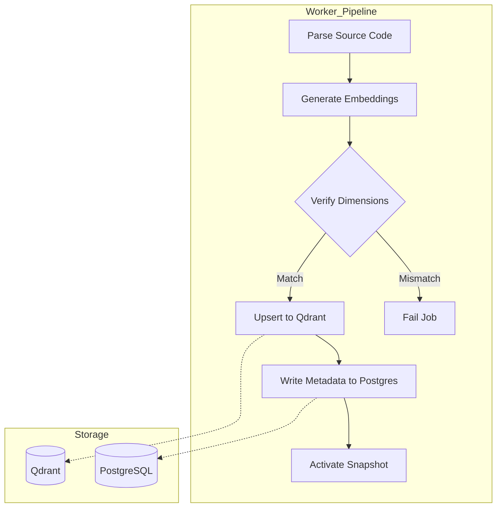
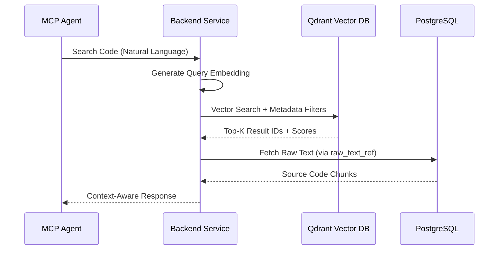

<details>
<summary>Relevant source files</summary>

The following files were used as context for generating this wiki page:

- [concept/tickets/backend-worker/09-pipeline.md](https://github.com/YannickTM/code-intelegence/blob/main/concept/tickets/backend-worker/09-pipeline.md)
</details>

# Vector DB (Qdrant) Strategy

The Vector DB Strategy centers on using Qdrant as the semantic memory layer for the project. Its primary purpose is to store high-dimensional vector embeddings of code chunks, enabling natural-language retrieval and semantic search capabilities that go beyond simple keyword matching. By indexing code at various granularities—such as functions, classes, and modules—the system allows AI agents to query the codebase using intent-based searches like "find code that handles authentication".

The scope of this strategy includes collection management, payload schema definition, and integration with the wider ingestion pipeline. Qdrant operates alongside a relational database (PostgreSQL) in a dual-store model, where Qdrant handles similarity searches while PostgreSQL maintains structured metadata and the source-of-truth for raw code content. This separation ensures efficient querying and clear data ownership.

## Collection Management

### Naming and Isolation
To prevent "score corruption" from incompatible vector spaces, the system enforces a strict isolation policy: embeddings from different model versions are never mixed in the same collection. Collections are scoped per project and per embedding model version.

The recommended naming convention for collections is:
`project_{project_id}__emb_{embedding_version}`

This approach facilitates safe model upgrades—where a new collection is created for a new model version—and allows for simple rollbacks by switching the active pointer in the relational database.
Sources: [concept/tickets/backend-worker/09-pipeline.md]()

### Index Configuration
The configuration of Qdrant collections is tuned for performance and accuracy using HNSW (Hierarchical Navigable Small World) indexing.

| Parameter | Recommended Value | Description |
| :--- | :--- | :--- |
| **Vector Size** | 768 or 1024 | Depends on the Ollama/Voyage model dimensions. |
| **Distance Metric** | Cosine | Best for normalized embeddings. |
| **m** | 16 | Number of connections per layer in HNSW. |
| **ef_construct** | 128 | Construction-time search width. |
| **indexing_threshold**| 20,000 | Point at which to start HNSW optimization. |
| **memmap_threshold** | 50,000 | Switch to mmap for large collections to save RAM. |

## Data Modeling and Payload

### Payload Schema
While the high-dimensional vectors are stored for search, each "point" in Qdrant includes a metadata payload. This payload is kept lean to minimize memory bloat, referencing the full raw text via a PostgreSQL ID.

```json
{
  "project_id": "uuid",
  "index_snapshot_id": "uuid",
  "file_path": "services/auth/handler.ts",
  "language": "typescript",
  "symbol_name": "validateToken",
  "symbol_type": "function",
  "chunk_type": "function",
  "chunk_hash": "sha256:...",
  "start_line": 41,
  "end_line": 96,
  "git_commit": "a1b2c3d4",
  "raw_text_ref": "db://code_chunks/{chunk_id}"
}
```

### Chunking Strategy
The system uses a **hybrid chunking strategy** to provide both precision and context:
*   **Function/Method chunks**: Extracted as individual units for specific logic retrieval.
*   **Class declaration chunks**: Captures the signature and docstring separately from methods.
*   **Module-level chunks**: Includes imports, constants, and top-level context.

## Data Flow and Lifecycle

### Ingestion Pipeline
The `backend-worker` manages the transition of parsed code into Qdrant. A snapshot is only activated once both PostgreSQL artifacts and Qdrant vectors are successfully persisted.


The diagram shows the worker's sequence for transforming parsed output into a searchable index, emphasizing the validation of vector dimensions and atomic snapshot activation.
Sources: [concept/tickets/backend-worker/09-pipeline.md, 117-128]()

### Operations and Triggers
Qdrant operations are integrated into the project lifecycle as follows:

| Operation | Trigger | Description |
| :--- | :--- | :--- |
| **Create Collection** | First Index / New Model | Initialize with dimensions from embedding config. |
| **Upsert Vectors** | Indexing Job | Insert or update code chunk embeddings. |
| **Delete by Filter** | File Delete / Re-index | Remove vectors using `index_snapshot_id` or `file_path`. |
| **Drop Collection** | Project Deletion | Complete cleanup of a project's vector data. |

## Retrieval and Querying

The Query Layer combines Qdrant's semantic search with metadata filters to refine results. Typical filters include `language`, `symbol_type`, or `file_path` patterns.


The sequence illustrates how a natural language query is transformed into a vector search and then enriched with structured data from the relational store.

## Capacity and Performance
Memory usage in Qdrant is primarily driven by vector dimensions and payload size.
*   **Small Projects (~1k files)**: ~100k - 250k vectors, roughly 400 MB RAM.
*   **Medium Projects (~10k files)**: ~1M - 2.5M vectors, roughly 4 GB RAM.
*   **Large Repositories**: May require Qdrant cluster mode and scalar/product quantization to manage memory.

