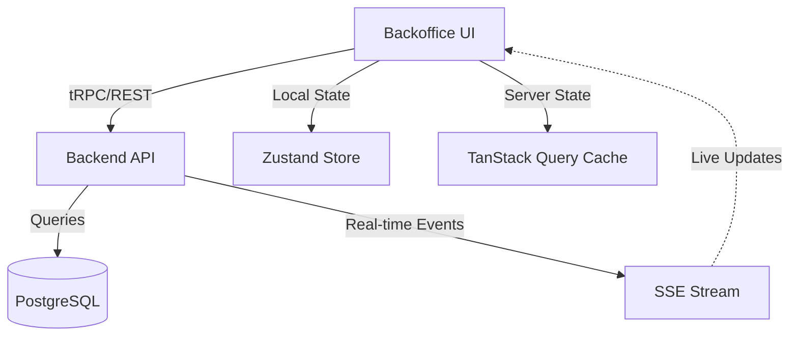
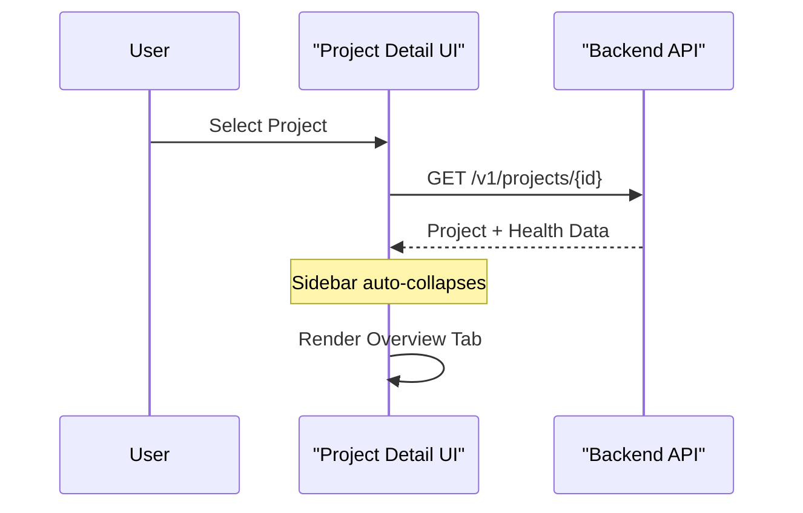

<details>
<summary>Relevant source files</summary>

The following files were used as context for generating this wiki page:

- [concept/tickets/backoffice/02-dashboard.md](https://github.com/YannickTM/code-intelegence/blob/main/concept/tickets/backoffice/02-dashboard.md)
- [concept/05-backoffice-ui.md](https://github.com/YannickTM/code-intelegence/blob/main/concept/05-backoffice-ui.md)
- [concept/tickets/backoffice/03-projects.md](https://github.com/YannickTM/code-intelegence/blob/main/concept/tickets/backoffice/03-projects.md)
- [backoffice/src/app/%28app%29/dashboard/page.tsx](https://github.com/YannickTM/code-intelegence/blob/main/backoffice/src/app/%28app%29/dashboard/page.tsx)
- [backoffice/src/components/dashboard/dashboard-content.tsx](https://github.com/YannickTM/code-intelegence/blob/main/backoffice/src/components/dashboard/dashboard-content.tsx)
- [backoffice/src/components/dashboard/project-health-list.tsx](https://github.com/YannickTM/code-intelegence/blob/main/backoffice/src/components/dashboard/project-health-list.tsx)
</details>

# Backoffice UI: Dashboard & Overview

## Introduction

The Backoffice UI serves as the centralized operational console for the MYJUNGLE Code Intelligence Platform. Its primary purpose is to allow administrators and developers to manage multiple projects, monitor indexing jobs, and oversee system health. The Dashboard acts as the landing page, designed to answer the critical question: "Is everything indexed and healthy, and are my agents using it?"

The interface is built as a Single Page Application (SPA) using React, TypeScript, and Vite. It utilizes a progressive rendering strategy where UI zones only appear when relevant data is available, ensuring a clean and actionable overview of the platform's state. Key functionalities include project configuration, real-time job observation via Server-Sent Events (SSE), and knowledge exploration across indexed repositories.

Sources: [concept/05-backoffice-ui.md:3-11](), [concept/tickets/backoffice/02-dashboard.md]()

## System Architecture and Tech Stack

The Backoffice is built on a modern web stack optimized for type safety and real-time updates. It integrates directly with the backend REST API and consumes events via SSE for live UI reactivity.

| Layer | Technology |
| :--- | :--- |
| **Framework** | React + TypeScript |
| **Build Tool** | Vite |
| **Routing** | React Router / Next.js |
| **Server State** | TanStack Query (React Query) |
| **Local State** | Zustand |
| **Real-time** | SSE via EventSource API |
| **Components** | Shadcn/ui + Tailwind CSS |
| **Charts** | Recharts or ECharts |

Sources: [concept/05-backoffice-ui.md:40-52]()

### Data Flow Diagram
The following diagram illustrates how the Backoffice UI interacts with the backend services to maintain a live state of the platform.


The UI maintains a dual-state approach: TanStack Query manages cached server data with periodic polling (30s in Phase 1), while SSE provides immediate updates to the local Zustand store for job transitions.
Sources: [concept/tickets/backoffice/02-dashboard.md]()

## Dashboard Structure

The Dashboard is organized into four distinct zones that render conditionally based on the system's current state.

### Zone 1: Health Strip
A compact horizontal bar providing high-level aggregate statistics. It displays the total project count, the number of currently running jobs (highlighted in teal/blue if > 0), and failed jobs within the last 24 hours (highlighted with a red badge if > 0).
Sources: [concept/tickets/backoffice/02-dashboard.md]()

### Zone 2: Alerts (Conditional)
This zone renders only when actionable issues exist, such as failed indexing jobs, projects that have never been indexed, or stale indexes older than 48 hours. Alerts are dismissible and stored in `localStorage` with a 24-hour expiration.
Sources: [concept/tickets/backoffice/02-dashboard.md]()

### Zone 3: Project Health List
The primary content area, displaying a table of all projects. Each row provides a summary of the project's current status and health.

| Column | Description |
| :--- | :--- |
| **Status Dot** | Color-coded: Green (Healthy), Yellow (Stale > 48h), Red (Failed), Grey (Never indexed). |
| **Name** | Project name linking to the Project Detail view. |
| **Commit** | Short 7-character hash of the last successfully indexed commit. |
| **Last Indexed** | Relative time since the last successful snapshot activation. |
| **Health** | Text label providing a descriptive status (e.g., "Action needed"). |

Sources: [concept/tickets/backoffice/02-dashboard.md]()

### Zone 4: Agent Activity (Conditional)
Displays query volume and performance metrics if `query_count_24h > 0`. It provides visibility into how MCP agents are utilizing the platform, including p95 latency figures.
Sources: [concept/tickets/backoffice/02-dashboard.md]()

## Project Overview and Detail Frame

Upon selecting a project, the UI navigates to a detailed view organized by a horizontal tab system.


Entering the project detail route triggers an automatic sidebar collapse to maximize workspace for code and data exploration.
Sources: [concept/tickets/backoffice/03-projects.md]()

### Overview Tab Components
The Overview tab uses a two-column layout to provide immediate project context:
*   **Left Column (~65%)**: Contains the File Tree/Browser for navigating indexed repository content.
*   **Right Column (~35%)**: Displays an Index Summary Card (active snapshot info) and the SSH Deploy Key Card for managing repository access.
Sources: [concept/tickets/backoffice/03-projects.md]()

## API Integration and Data Models

The Dashboard and Overview components rely on extended project models that include health metadata.

### Dashboard Summary Response
```json
{
  "projects_total": 12,
  "jobs_active": 2,
  "jobs_failed_24h": 1,
  "query_count_24h": 247,
  "p95_latency_ms_24h": 38
}
```
Sources: [concept/tickets/backoffice/02-dashboard.md]()

### Project Health Data
The project object is extended with the following fields to facilitate the Overview and Health List views:
*   `index_git_commit`: Hash of the currently active index.
*   `index_branch`: The branch used for the active index.
*   `index_activated_at`: Timestamp of index activation.
*   `running_job_id`: ID of a currently active job, if any.
*   `failed_job_id`: ID of the most recent failed job within 24 hours.
Sources: [concept/tickets/backoffice/02-dashboard.md]()

## Summary
The Backoffice UI: Dashboard & Overview module provides a specialized management layer for the MYJUNGLE platform. By combining a "health-first" dashboard with detailed project-specific views, it allows users to maintain repository synchronization and monitor AI agent interactions effectively. The use of conditional rendering and state-synchronized alerts ensures that developers can focus on resolving issues quickly within a clean, GitHub-inspired interface.
