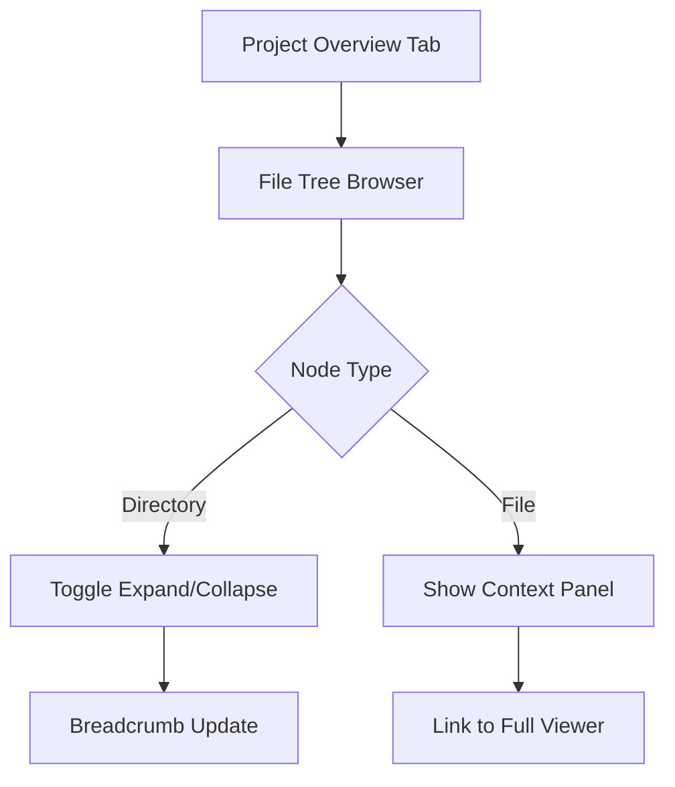
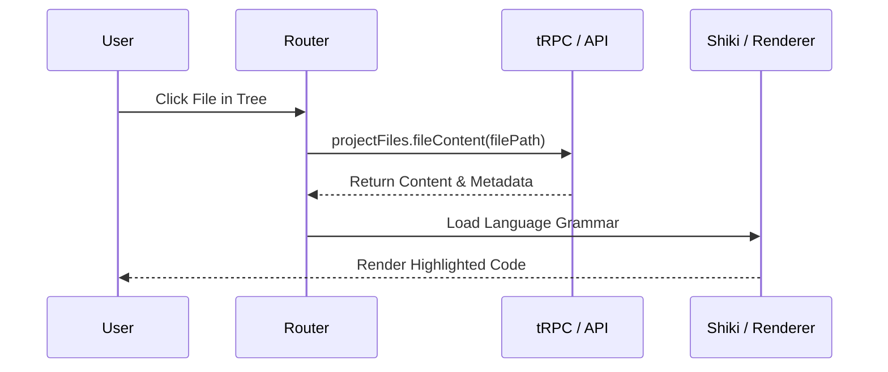
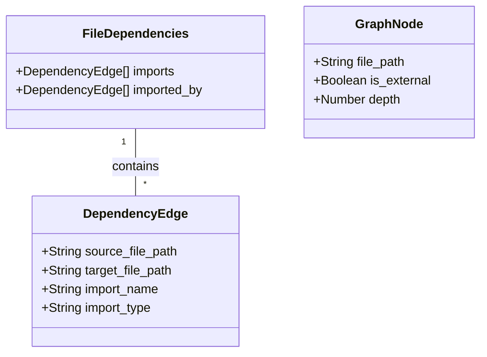

Relevant source files

The following files were used as context for generating this wiki page:

- [concept/tickets/backoffice/09-file-browser.md](https://github.com/YannickTM/code-intelegence/blob/main/concept/tickets/backoffice/09-file-browser.md)
- [concept/tickets/backoffice/09-file-browser.md](https://github.com/YannickTM/code-intelegence/blob/main/concept/tickets/backoffice/09-file-browser.md)
- [concept/tickets/backoffice/11-dependency-graph.md](https://github.com/YannickTM/code-intelegence/blob/main/concept/tickets/backoffice/11-dependency-graph.md)
- [concept/tickets/backoffice/10-file-analysis-cards.md](https://github.com/YannickTM/code-intelegence/blob/main/concept/tickets/backoffice/10-file-analysis-cards.md)
- [concept/tickets/backoffice/09-file-browser.md](https://github.com/YannickTM/code-intelegence/blob/main/concept/tickets/backoffice/09-file-browser.md)
- [concept/tickets/backoffice/03-projects.md](https://github.com/YannickTM/code-intelegence/blob/main/concept/tickets/backoffice/03-projects.md)

# Backoffice UI: Project File Explorer

## Introduction

The **Project File Explorer** is a core module of the Backoffice UI designed to provide a comprehensive, GitHub-like interface for navigating and analyzing indexed project codebases. It serves as the primary gateway for developers to browse the repository structure, view syntax-highlighted source code, and explore complex metadata such as file dependencies, symbol exports, and editorial history.

The system is integrated within the Project Detail view, primarily residing in the **Overview** and **Code** tabs. It transitions from a high-level file tree browser to a detailed file viewer capable of rendering code, markdown, and interactive dependency graphs. This module ensures that indexed knowledge is not just searchable but also visually navigable for auditing and development purposes.

Sources: [concept/tickets/backoffice/09-file-browser.md](), [concept/tickets/backoffice/09-file-browser.md]()

---

## File Browser & Navigation

The initial entry point for code exploration is the **File Tree Browser**, located in the Overview tab. It provides a hierarchical representation of the project's indexed files, utilizing language-aware icons and collapsible directory nodes to mirror the repository's physical structure.

### Tree Architecture
The browser implements a "Full tree upfront" strategy for Phase 1, where the entire directory structure is loaded via a single API call. Navigation is managed through breadcrumbs that allow users to scope the view to specific subdirectories.

*The diagram shows the interaction flow within the File Tree Browser.*

Sources: [concept/tickets/backoffice/09-file-browser.md](), [concept/tickets/backoffice/09-file-browser.md]()

### Key Components & Logic
| Component | Description |
| :--- | :--- |
| **File Tree** | Collapsible list of directories and files, sorted with directories first. |
| **Breadcrumbs** | Monospace path segments (e.g., `root / src / components /`) for level-up navigation. |
| **Context Panel** | A right-column summary showing file path, size, and last indexed timestamp upon selection. |

Sources: [concept/tickets/backoffice/09-file-browser.md]()

---

## Code File Viewer

When a file is selected, the UI navigates to a dedicated route (`/projects/[id]/file?path=...`) providing a full-content viewer. This interface uses a two-column grid: a main code area (70%) and an analysis sidebar (340px).

### Technical Implementation
The viewer utilizes the **Shiki** library for high-quality, theme-aware syntax highlighting. For specific file types like Markdown and Mermaid, a "Preview Mode" is available to render documentation and diagrams directly.

*The sequence illustrates the data flow from file selection to rendering.*

Sources: [concept/tickets/backoffice/09-file-browser.md](), [concept/tickets/backoffice/09-file-browser.md]()

### Preview Support
| Language | Renderer | Feature |
| :--- | :--- | :--- |
| **HTML** | Sandboxed `<iframe>` | Renders with `srcdoc` and theme-aware base styles. |
| **Markdown** | `react-markdown` | Supports GFM (GitHub Flavored Markdown) and Shiki code blocks. |
| **Mermaid** | `mermaid` library | Renders diagrams as SVGs with dark/light mode support. |

Sources: [concept/tickets/backoffice/09-file-browser.md]()

---

## Analysis Sidebar & V2 Metadata

The right column of the file viewer hosts a stack of **Analysis Cards**. These cards display "v2 parser" data, providing deep technical insights into the file's role within the system.

### Metadata Cards
1.  **File Info:** Core metrics like size, line count, and last indexed time.
2.  **File Facts:** Boolean indicators (badges) for features like `has_jsx`, `has_tests`, or `has_fetch_calls`.
3.  **Exports:** List of named, default, and re-exported symbols with line number links.
4.  **Diagnostics:** Issues identified during parsing (e.g., `LONG_FUNCTION`), sorted by severity (Error, Warning, Info).
5.  **Editorial History:** A chronological list of Git commits that modified the file, linked to the Commit Browser.

Sources: [concept/tickets/backoffice/09-file-browser.md](), [concept/tickets/backoffice/10-file-analysis-cards.md]()

---

## Dependency Exploration

The explorer includes a specialized **File Dependencies** system to visualize imports and "imported-by" relationships.

### Dependency Graph
For visual exploration, users can launch a **Dependency Graph Dialog** powered by `@xyflow/react`. This tool uses a hierarchical layout (Dagre) to map the file's neighborhood.

*Class structure of the dependency data model.*

### Integration Details
*   **Lazy Loading:** Graph data is only fetched when the "View dependency graph" button is clicked.
*   **Interaction:** Clicking a node within the graph navigates the explorer to that file's detail view.
*   **Filtering:** A depth selector allows users to toggle between 1 and 5 levels of traversal.

Sources: [concept/tickets/backoffice/11-dependency-graph.md](), [concept/tickets/backoffice/11-dependency-graph.md]()

---

## Data Management & API

The system relies on a set of tRPC procedures to communicate with the backend API.

| Procedure | Path | Input |
| :--- | :--- | :--- |
| `projectFiles.fileContent` | `/v1/projects/{id}/files/context` | `projectId`, `filePath` |
| `projectFiles.fileHistory` | `/v1/projects/{id}/files/history` | `projectId`, `filePath`, `limit` |
| `projectFiles.fileDependencies`| `/v1/projects/{id}/files/dependencies`| `projectId`, `filePath` |
| `projectFiles.dependencyGraph` | `/v1/projects/{id}/dependencies/graph` | `projectId`, `root`, `depth` |

Sources: [concept/tickets/backoffice/09-file-browser.md](), [concept/tickets/backoffice/11-dependency-graph.md]()

## Conclusion

The Backoffice UI Project File Explorer provides a robust interface for navigating codebase complexities. By combining hierarchical file browsing with deep analysis tools like dependency graphs and diagnostic cards, it enables developers to understand both the structure and the health of their indexed repositories. Its integration of modern rendering libraries like Shiki and @xyflow ensures a performant and intuitive technical experience.

Sources: [concept/tickets/backoffice/09-file-browser.md](), [concept/tickets/backoffice/10-file-analysis-cards.md]()
