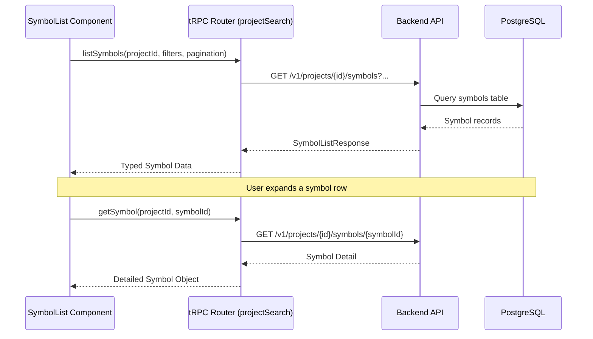
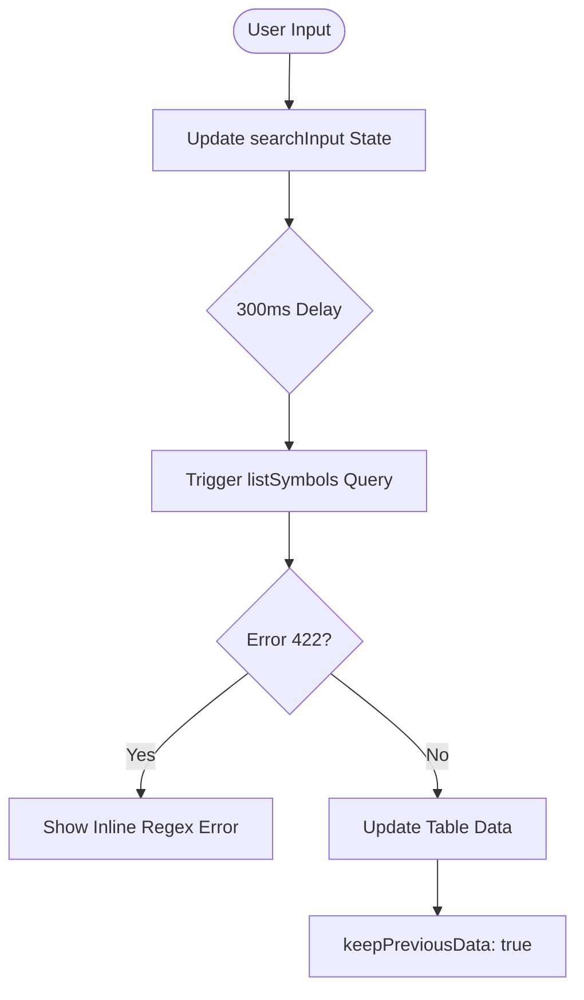

<details>
<summary>Relevant source files</summary>

The following files were used as context for generating this wiki page:

- [concept/tickets/backoffice/08-symbol-browser.md](https://github.com/YannickTM/code-intelegence/blob/main/concept/tickets/backoffice/08-symbol-browser.md)
- [concept/tickets/backoffice/08-symbol-browser.md](https://github.com/YannickTM/code-intelegence/blob/main/concept/tickets/backoffice/08-symbol-browser.md)
- [concept/tickets/backoffice/08-symbol-browser.md](https://github.com/YannickTM/code-intelegence/blob/main/concept/tickets/backoffice/08-symbol-browser.md)
- [backoffice/src/server/api/routers/project-search.ts](https://github.com/YannickTM/code-intelegence/blob/main/backoffice/src/server/api/routers/project-search.ts) (Referenced via task definitions)
- [concept/tickets/backoffice/03-projects.md](https://github.com/YannickTM/code-intelegence/blob/main/concept/tickets/backoffice/03-projects.md)
- [concept/05-backoffice-ui.md](https://github.com/YannickTM/code-intelegence/blob/main/concept/05-backoffice-ui.md)
</details>

# Backoffice UI: Symbol Browser

## Introduction
The Symbol Browser is a core functional component of the Backoffice UI, designed to provide a comprehensive read-path for symbol data extracted during the project indexing process. Located at the `/projects/[id]/symbols` route, it replaces initial placeholders with a robust interface for searching, filtering, and inspecting code symbols such as functions, classes, interfaces, and variables. 

Its primary purpose is to allow developers and administrators to explore the structured knowledge graph of a project, offering high-level overviews and granular details of code entities. It integrates directly with the `projectSearch` tRPC router to fetch paginated symbol lists and detailed symbol metadata, including signatures, documentation, and relationships.
Sources: [concept/tickets/backoffice/08-symbol-browser.md](), [concept/05-backoffice-ui.md]()

## Architecture and Data Flow

The Symbol Browser follows a standard client-server architecture using React for the frontend and tRPC for type-safe API communication with the backend. 

### Data Acquisition Flow
The system consumes two primary backend endpoints through tRPC procedures:
1.  **`projectSearch.listSymbols`**: Handles paginated retrieval of symbols with support for name searching, kind filtering, and advanced directory inclusion/exclusion.
2.  **`projectSearch.getSymbol`**: Fetches detailed information for a specific symbol, typically triggered when a user expands a row in the symbol list.


The diagram shows the standard flow for listing and then drilling down into specific symbol details.
Sources: [concept/tickets/backoffice/08-symbol-browser.md](), [concept/tickets/backoffice/08-symbol-browser.md]()

## User Interface Components

### Symbol List and Filter Bar
The main view consists of a header with total counts, a snapshot freshness indicator, and an advanced filter bar. The filter bar mirrors VS Code-like search controls, including:
*   **Name Search**: A debounced (300ms) text input for symbol names.
*   **Search Mode Toggles**: Buttons for "Match Case" (**Aa**) and "Regular Expression" (**.\***).
*   **Kind Filter**: A dropdown to filter by symbol types (e.g., Class, Function, Interface).
*   **Advanced Directory Filters**: Collapsible inputs for `include_dir` and `exclude_dir` using glob patterns.

Sources: [concept/tickets/backoffice/08-symbol-browser.md](), [concept/tickets/backoffice/08-symbol-browser.md]()

### Symbol Table
The table displays symbol metadata in a structured format:
| Column | Description |
| :--- | :--- |
| **Name** | Monospace symbol name with optional `Export`, `Default`, or `Async` badges. |
| **Kind** | Badge with variant colors (e.g., Blue for Function, Purple for Class). |
| **Type** | New in V2: Displays `return_type` (e.g., `→ Promise<User>`). |
| **File** | Link to the file viewer at the specific `start_line`. |
| **Lines** | The `start_line–end_line` range. |

Sources: [concept/tickets/backoffice/08-symbol-browser.md](), [concept/tickets/backoffice/08-symbol-browser.md]()

### Symbol Detail Panel
When a row is clicked, an accordion-style panel expands to show:
*   **Signature**: A syntax-highlighted monospace block.
*   **Documentation**: `doc_text` rendered as markdown.
*   **Type Info**: Detailed parameter types and return types.
*   **Flags Summary**: A collapsible section showing boolean properties like `is_static`, `is_readonly`, or `is_react_component_like`.
*   **Source Link**: A button to "View Source" in the file viewer.

Sources: [concept/tickets/backoffice/08-symbol-browser.md](), [concept/tickets/backoffice/08-symbol-browser.md]()

## Data Structures

The following TypeScript definitions represent the core data models used within the Symbol Browser.

### Symbol Object (V2)
```typescript
type Symbol = {
  id: string;
  name: string;
  qualified_name?: string;
  kind: string;
  signature?: string;
  start_line?: number;
  end_line?: number;
  doc_text?: string;
  file_path: string;
  language?: string;
  flags?: {
    is_exported?: boolean;
    is_async?: boolean;
    is_static?: boolean;
    is_react_component_like?: boolean;
  };
  return_type?: string;
  parameter_types?: string[];
};
```
Sources: [concept/tickets/backoffice/08-symbol-browser.md](), [concept/tickets/backoffice/08-symbol-browser.md]()

## State Management and Filtering Logic

The browser utilizes local React state to manage filters and pagination, with `useDebounce` to optimize API requests. 


The flow highlights how debouncing and the `keepPreviousData` option prevent UI flickering and handle invalid regex patterns gracefully without clearing the screen.
Sources: [concept/tickets/backoffice/08-symbol-browser.md](), [concept/tickets/backoffice/12-commit-browser.md]()

## Key Implementation Files

| File Path | Role |
| :--- | :--- |
| `src/server/api/routers/project-search.ts` | Implements tRPC procedures for `listSymbols` and `getSymbol`. |
| `src/app/(app)/projects/[id]/symbols/page.tsx` | Main page route that hosts the Symbol Browser. |
| `src/components/project-detail/symbol-list.tsx` | Main component for the table, search, and pagination. |
| `src/components/project-detail/symbol-detail-panel.tsx` | Component for the expanded row detail view. |

Sources: [concept/tickets/backoffice/08-symbol-browser.md](), [concept/tickets/backoffice/08-symbol-browser.md]()

## Summary
The Symbol Browser serves as a critical exploration tool within the Backoffice UI, enabling users to navigate a project's indexed symbols with high efficiency. By leveraging advanced filtering, V2 parser metadata (like return types and flags), and a GitHub-inspired layout, it provides a seamless experience for understanding complex codebases. Its architecture ensures technical accuracy and performance through debouncing, type-safe communication, and persistent UI states during data fetching.
