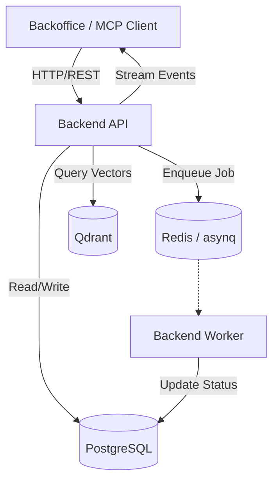

<details>
<summary>Relevant source files</summary>

The following files were used as context for generating this wiki page:

- [concept/tickets/backend-api/01-foundation.md](https://github.com/YannickTM/code-intelegence/blob/main/concept/tickets/backend-api/01-foundation.md)
- [concept/tickets/backend-api/01-foundation.md](https://github.com/YannickTM/code-intelegence/blob/main/concept/tickets/backend-api/01-foundation.md)
- [concept/01-system-overview.md](https://github.com/YannickTM/code-intelegence/blob/main/concept/01-system-overview.md)
- [README.md](https://github.com/YannickTM/code-intelegence/blob/main/README.md)
</details>

# Backend API Architecture

## Introduction

The Backend API serves as the central orchestration layer for the MYJUNGLE Code Intelligence Platform. It is responsible for project lifecycle management, workflow request entry points (such as indexing), authentication, and providing read-oriented APIs for both the Backoffice UI and the Model Context Protocol (MCP) server. 

The architecture is designed to be multi-project from day one, ensuring strict project isolation and persistent storage of code intelligence in a dual-store model comprising PostgreSQL and Qdrant. It acts as the primary interface for external clients to interact with the system's underlying code analysis and retrieval capabilities.

Sources: [concept/01-system-overview.md](), [README.md]()

## Core Component Roles

The Backend API operates within a distributed topology, coordinating between databases, message queues, and worker services.

| Component | Role in API Architecture |
| :--- | :--- |
| **Go HTTP Server** | Handles RESTful requests via the `chi` router and manages the lifecycle of the application. |
| **PostgreSQL** | Acts as the durable source of truth for project metadata, job states, snapshots, and indexed artifacts. |
| **Redis / asynq** | Serves as the asynchronous transport for enqueuing indexing jobs and other background workflows. |
| **Qdrant** | Provides vector retrieval capabilities for semantic code search, queried by the API for RAG workflows. |
| **SSE Bridge** | Pushes real-time job events and progress updates to the Backoffice UI. |

Sources: [README.md:30-45](), [concept/01-system-overview.md:55-75]()

## System Design and Data Flow

The API follows a project-scoped execution model. When a workflow is requested, the API validates the request, creates a durable job record in PostgreSQL, and enqueues a lightweight message into Redis.

### High-Level Request Flow
The following diagram illustrates how the Backend API interacts with infrastructure and other services:


The Backend API owns project lifecycle and workflow entry points, while the `backend-worker` executes the actual high-latency tasks.
Sources: [concept/01-system-overview.md:80-95]()

## Internal Package Structure

The project utilizes a structured `internal/` package layout to enforce dependency injection and separation of concerns.

### Directory Scaffold
*   `cmd/api/main.go`: The entry point that loads configuration and starts the server.
*   `internal/app/`: Contains the `App` struct, which holds dependencies, and `routes.go` for route registration.
*   `internal/domain/`: Defines shared domain types (Project, User, SSHKey) and structured error types.
*   `internal/handler/`: Contains the HTTP handlers for projects, health checks, and API keys.
*   `internal/middleware/`: Implements the request processing pipeline.

Sources: [concept/tickets/backend-api/01-foundation.md]()

### Middleware Chain
Requests pass through a standardized chain of middleware to ensure security, observability, and stability:
1.  **RequestID**: Injects an `X-Request-ID` for tracing.
2.  **Logging**: Captures request metadata (method, path, status, duration).
3.  **Metrics**: Collects performance data.
4.  **Recover**: Gracefully handles panics and returns a 500 status.
5.  **CORS**: Manages cross-origin resource sharing based on allowed origins.
6.  **BodyLimit**: Rejects request bodies exceeding 1MB.

Sources: [concept/tickets/backend-api/01-foundation.md](), [concept/tickets/backend-api/01-foundation.md]()

## Error Handling and Validation

The API implements a consistent error-handling pattern. All errors are returned in a standard JSON envelope matching the OpenAPI specification.

### Error Response Envelope
```json
{
  "error": "human-readable message",
  "code": "machine_readable_code",
  "details": { "field": "validation error detail" }
}
```
Sources: [concept/tickets/backend-api/01-foundation.md]()

### Validation Logic
The `internal/validate` package provides helpers for batch validation. Handlers utilize these helpers to check for required fields, valid UUIDs, and proper URL formats before processing business logic.
Sources: [concept/tickets/backend-api/01-foundation.md]()

## Security and Authentication

The security model is based on project-scoped isolation and hashed secrets.
*   **API Keys**: Used by MCP agents. These are hashed and stored in PostgreSQL, with access permissions managed via a join table (`api_key_projects`).
*   **SSH Keys**: Used for Git authentication. Private keys are encrypted at rest.
*   **Project Isolation**: Multi-project access is enforced on every query to prevent data leakage between different repositories.

Sources: [README.md:105-115]()

## Real-Time Communication (SSE)

The API utilizes Server-Sent Events (SSE) to push job progress to the Backoffice. This is preferred over WebSockets for its simplicity and native browser support.
*   **Endpoint**: `GET /v1/events/stream?projects=uuid1,uuid2`
*   **Events**: Includes `job:queued`, `job:started`, `job:progress`, `job:completed`, and `job:failed`.

Sources: [concept/01-system-overview.md:180-185]()

## Summary

The Backend API architecture prioritizes reliability and project isolation. By separating long-running indexing workflows into a worker-based model and using structured middleware and error handling, the API provides a stable foundation for AI agents to retrieve code intelligence. Its reliance on PostgreSQL as the single source of truth ensures consistency even during transient infrastructure failures.
