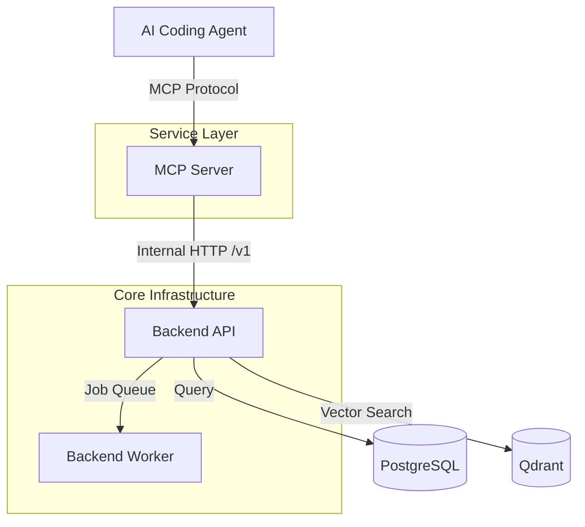
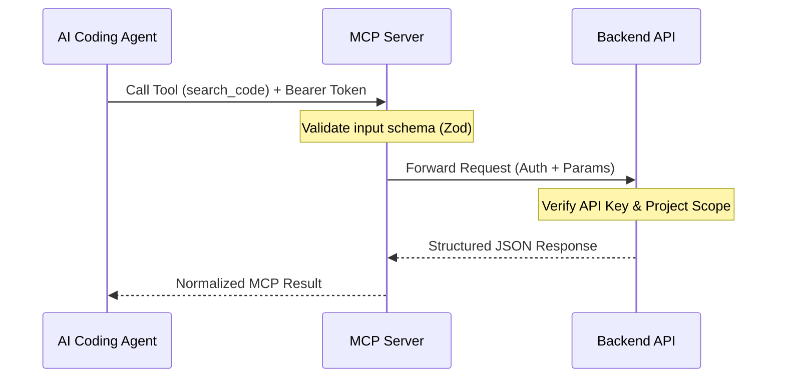

<details>
<summary>Relevant source files</summary>

The following files were used as context for generating this wiki page:

- [README.md](https://github.com/YannickTM/code-intelegence/blob/main/README.md)
- [concept/06-mcp-interface.md](https://github.com/YannickTM/code-intelegence/blob/main/concept/06-mcp-interface.md)
</details>

# Model Context Protocol Server

The Model Context Protocol (MCP) Server acts as the agent-facing compatibility layer for the MYJUNGLE platform. Its primary purpose is to expose high-quality code context retrieval tools to AI coding agents, such as Claude, Cursor, or Copilot, by delegating complex business logic to the Go-based `backend-api`. By abstracting the underlying data storage and indexing complexities, the MCP server provides a stable interface for agents to query persistent codebase knowledge.

Within the project topology, the MCP server is positioned as a separate service to allow the MCP transport protocol to evolve independently from the core backend logic. It supports multi-project environments from day one, ensuring that agents can retrieve context across different repositories while adhering to strict authentication and project scoping rules enforced by the backend.

Sources: [README.md:3-5](), [concept/06-mcp-interface.md:3-10]()

## System Architecture and Topology

The MCP Server is implemented using TypeScript and the `@modelcontextprotocol/sdk`. It functions as a stateless intermediary that does not directly access the system's databases (PostgreSQL, Qdrant) or internal services like Redis or Ollama. Instead, it communicates with the `backend-api` over internal HTTP to fulfill tool requests.

### Runtime Topology
The following diagram illustrates how the MCP Server fits into the overall system architecture:


The diagram shows the flow from an agent request through the MCP server to the backend infrastructure.
Sources: [README.md:25-32](), [concept/06-mcp-interface.md:12-20]()

## Communication and Transport

The server supports two primary transport modes to accommodate various integration scenarios:

*   **stdio**: Designed for local desktop or CLI agent integrations where the server and agent reside on the same machine.
*   **SSE (Server-Sent Events)**: Utilized for remote shared server integrations, exposing an HTTP port (default `4444`) for remote MCP clients.

Sources: [README.md:68](), [concept/06-mcp-interface.md:22-26]()

### Reliability and Security
To ensure robust operation, the MCP server implements a per-request timeout budget (defaulting to 10 seconds) and a circuit breaker behavior for repeated failures. Security is maintained by forwarding bearer tokens to the backend for validation without logging sensitive credentials.

Sources: [concept/06-mcp-interface.md:64-70](), [concept/06-mcp-interface.md:88-92]()

## Tool-to-Backend Mapping

The MCP server translates agent tool calls into specific backend API requests. Every tool call requires a `project_id` to enforce project-scoped access, though local `stdio` mode can configure an optional default project ID to reduce boilerplate.

### Phase 1 Tool Set

| MCP Tool | Backend Endpoint | Description |
| :--- | :--- | :--- |
| `search_code` | `POST /v1/projects/{id}/query/search` | Semantic search using natural language. |
| `get_symbol_info` | `GET /v1/projects/{id}/symbols/{id}` | Detailed info on functions, classes, or modules. |
| `get_dependencies` | `GET /v1/projects/{id}/dependencies` | Dependency graph for a specific file or module. |
| `get_project_structure`| `GET /v1/projects/{id}/structure` | High-level architectural overview. |

Sources: [concept/06-mcp-interface.md:33-43]()

### Request Sequence
The sequence of a tool invocation is as follows:


This sequence shows the validation and forwarding logic performed by the MCP server.
Sources: [concept/06-mcp-interface.md:45-50]()

## Data Schemas and Response Rules

The server enforces strict response shapes. All results must be structured JSON and include specific metadata for the agent's context, such as `query_time_ms`, `index_snapshot_id`, and `index_freshness_commit`.

### Example: search_code Schema
```json
{
  "name": "search_code",
  "inputSchema": {
    "type": "object",
    "properties": {
      "project_id": { "type": "string" },
      "query": { "type": "string" },
      "language": {
        "type": "string",
        "description": "Filter by language. Phase 1: typescript, javascript"
      },
      "limit": { "type": "integer", "default": 10 }
    },
    "required": ["project_id", "query"]
  }
}
```
Sources: [concept/06-mcp-interface.md:58-62](), [concept/06-mcp-interface.md:77-86]()

## Summary

The Model Context Protocol Server is a critical interface for AI agents to interact with the MYJUNGLE code intelligence platform. By isolating the agent-facing protocol from the core Go backend, the system maintains high reliability, security, and flexibility. It provides essential tools for semantic code search, symbol analysis, and structural retrieval, ensuring agents have the necessary context to perform high-quality coding tasks without the overhead of re-parsing source code in every session.

Sources: [README.md:3-6]()
