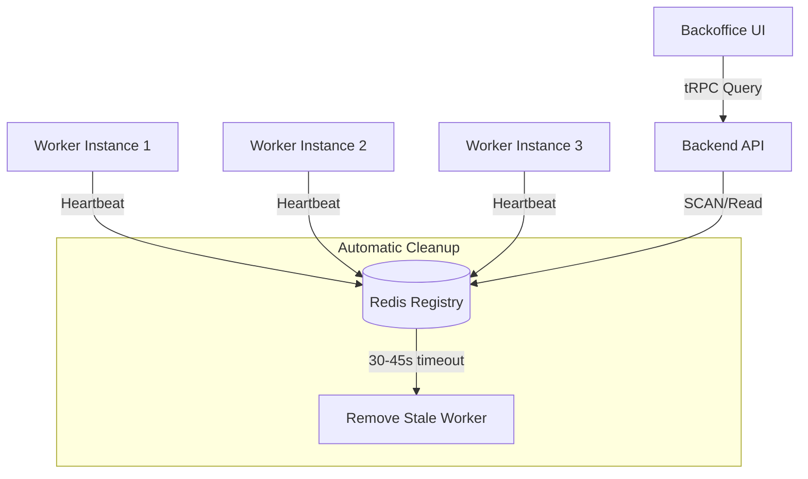
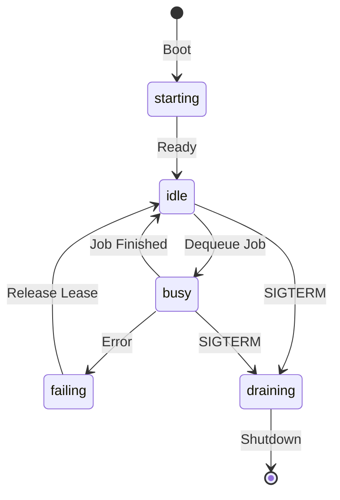

<details>
<summary>Relevant source files</summary>

The following files were used as context for generating this wiki page:

- [concept/tickets/backoffice/14-platform-admin.md](https://github.com/YannickTM/code-intelegence/blob/main/concept/tickets/backoffice/14-platform-admin.md)
- [concept/worker/03-Communication-between-components-container.md](https://github.com/YannickTM/code-intelegence/blob/main/concept/worker/03-Communication-between-components-container.md)
- [concept/tickets/backend-worker/01-foundation.md](https://github.com/YannickTM/code-intelegence/blob/main/concept/tickets/backend-worker/01-foundation.md)
- [concept/worker/01-Components.md](https://github.com/YannickTM/code-intelegence/blob/main/concept/worker/01-Components.md)
</details>

# Worker Heartbeats & Telemetry Registry

The Worker Heartbeats & Telemetry Registry is a critical observability system within the platform that monitors the health, status, and resource consumption of all active worker instances. It serves as an advisory registry where each live worker periodically publishes its current runtime status to a transient store (Redis), enabling platform administrators to view the system's operational state in real-time.

This registry provides a high-level overview of which workers are initializing, ready for tasks, or actively processing jobs. While PostgreSQL remains the durable source of truth for job lifecycle states, the Redis-backed registry facilitates rapid health checks, capacity planning, and graceful shutdown coordination across the distributed worker pool.
Sources: [concept/worker/03-Communication-between-components-container.md:104-121](), [concept/tickets/backoffice/14-platform-admin.md]()

## Architecture and Communication Flow

The registry operates on a "write-heavy, read-on-demand" model. Workers are responsible for maintaining their own presence in the registry through periodic heartbeats, while the backend API exposes this data via specific management endpoints.

### Data Flow Model

The heartbeat mechanism follows a decentralized approach:
1.  **Publishing:** Each `backend-worker` instance runs a background task that writes its status to Redis.
2.  **Storage:** Status data is stored in Redis using a Time-To-Live (TTL) mechanism to ensure that partitioned or crashed workers are automatically removed from the registry after a timeout.
3.  **Consumption:** The `backend-api` retrieves the list of active workers by performing a scan of the Redis registry.
4.  **Presentation:** The Backoffice UI fetches this data through a tRPC router to display the Platform Worker Status View.


This diagram shows the relationship between worker instances, the Redis storage layer, and the API/UI consumers.
Sources: [concept/worker/03-Communication-between-components-container.md:11-25](), [concept/tickets/backend-worker/01-foundation.md](), [concept/tickets/backoffice/14-platform-admin.md]()

### Heartbeat Contract
The communication between workers and the registry is governed by a strict timing contract:
*   **Interval:** Workers publish updates every 10 to 30 seconds.
*   **Timeout (TTL):** Registry entries expire after 30 to 90 seconds (typically 3 missed heartbeats).
*   **Mechanism:** Background goroutines or tasks automatically extend the lease/presence while the worker is healthy.
Sources: [concept/tickets/backend-worker/01-foundation.md]()

## Worker State Machine

Workers transition through several lifecycle states, which are reported via the heartbeat payload. These states inform the system whether a worker is available for new work or is currently occupied.

| Status | Description | UI Badge Color |
| :--- | :--- | :--- |
| `starting` | Worker is initializing or performing boot-up checks. | Yellow/Amber |
| `idle` | Ready to consume work; no active job assigned. | Green |
| `busy` | Currently executing a pipeline job (e.g., indexing). | Blue |
| `draining` | Finishing current work but will not accept new jobs; preparing for shutdown. | Orange |
| `stopped` | Shutting down (rarely seen due to rapid TTL expiry). | Gray |

Sources: [concept/tickets/backoffice/14-platform-admin.md](), [concept/tickets/backend-worker/01-foundation.md]()


The state machine illustrates the transitions reported to the telemetry registry during a worker's lifecycle.
Sources: [concept/worker/03-Communication-between-components-container.md:110-116]()

## Registry Schema and Telemetry Data

The registry stores a rich set of metadata and telemetry for each worker. This data is structured to allow for both basic identification and deep performance analysis.

### Worker Status Payload
The primary payload published to Redis (typically at key `workers:{worker_id}`) includes the following fields:

| Field | Type | Description |
| :--- | :--- | :--- |
| `worker_id` | UUID | Unique identifier for the worker instance. |
| `status` | Enum | Current state (`idle`, `busy`, etc.). |
| `hostname` | String | The network hostname of the container/node. |
| `version` | String | The build version of the worker software. |
| `started_at` | ISO8601 | Timestamp when the worker process began. |
| `last_heartbeat_at` | ISO8601 | Timestamp of the most recent update. |
| `supported_workflows` | Array | Workflows the worker can handle (e.g., `full-index`, `rag-repo`). |
| `current_job_id` | UUID | (Optional) The ID of the job currently being processed. |
| `drain_reason` | String | (Optional) Reason for entering the `draining` state. |

Sources: [concept/tickets/backoffice/14-platform-admin.md](), [concept/tickets/backend-worker/01-foundation.md]()

### Resource Reporting Metrics
In addition to status, heartbeats include resource usage telemetry for capacity planning and detecting bottlenecks:

```json
{
  "memory_mb": 512,
  "memory_pct": 62.5,
  "cpu_pct": 45.2,
  "goroutines": 24,
  "open_connections": 6,
  "event_buffer_usage_pct": 12.3,
  "disk_usage_mb": 1024,
  "git_repo_size_mb": 856
}
```
*Note: Disk usage and Git repository size reporting are additions introduced in v5 of the SDK.*

## Backend API and Management Endpoints

The `backend-api` acts as a gateway to the transient registry, exposing worker telemetry to external clients (primarily the Backoffice).

### Platform Worker Status Endpoint
*   **Path:** `GET /v1/platform-management/workers`
*   **Internal logic:** Performs a Redis `SCAN` for the `workers:*` pattern, retrieves the payloads, and returns a collection of `WorkerStatus` objects.
*   **Performance Note:** To avoid blocking Redis, the backend uses `SCAN` operations rather than `KEYS`.
Sources: [concept/tickets/backoffice/14-platform-admin.md](), [concept/tickets/backoffice/14-platform-admin.md]()

### tRPC Integration
The Backoffice interacts with the registry through the `platformWorkers` router:
```typescript
const workersQuery = api.platformWorkers.list.useQuery(undefined, {
  retry: false,
});

const handleRefresh = () => {
  void utils.platformWorkers.list.invalidate();
};
```
The UI uses manual refresh logic rather than auto-polling to keep the implementation simple and avoid unnecessary Redis operations.
Sources: [concept/tickets/backoffice/14-platform-admin.md]()

## Operational Significance

The registry provides critical support for several operational workflows:

1.  **Capacity Planning:** Resource usage metrics (CPU/Memory) allow operators to determine if more worker replicas are needed during indexing surges.
2.  **Stall Detection:** If a worker remains in a `busy` state but its `last_heartbeat_at` timestamp stops updating, the system can identify a stalled job before the Redis TTL even expires.
3.  **Graceful Scale-Down:** By transitioning to the `draining` state, a worker signals to the platform that it is finishing its current task and should not be assigned new work, allowing for clean termination during deployment rollouts.
4.  **Zombie Cleanup:** The Redis TTL ensures that if a container is hard-killed (e.g., OOM killed), it will automatically vanish from the dashboard within 45 seconds.
Sources: [concept/tickets/backend-worker/01-foundation.md](), [concept/tickets/backoffice/14-platform-admin.md]()

The Worker Heartbeats & Telemetry Registry provides the necessary transparency to manage a distributed fleet of workers, ensuring that the current system state is always observable without relying on long-term database transactions for transient liveness data.
