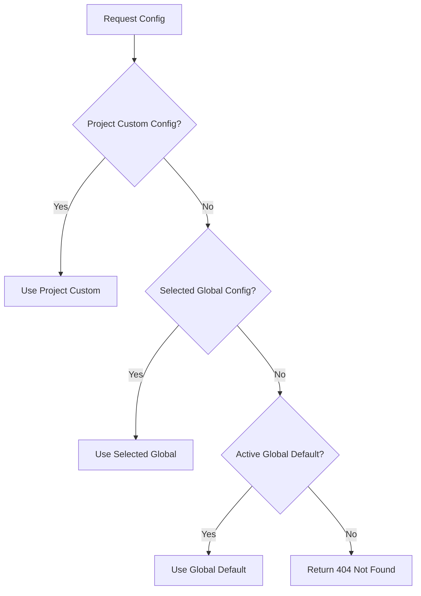
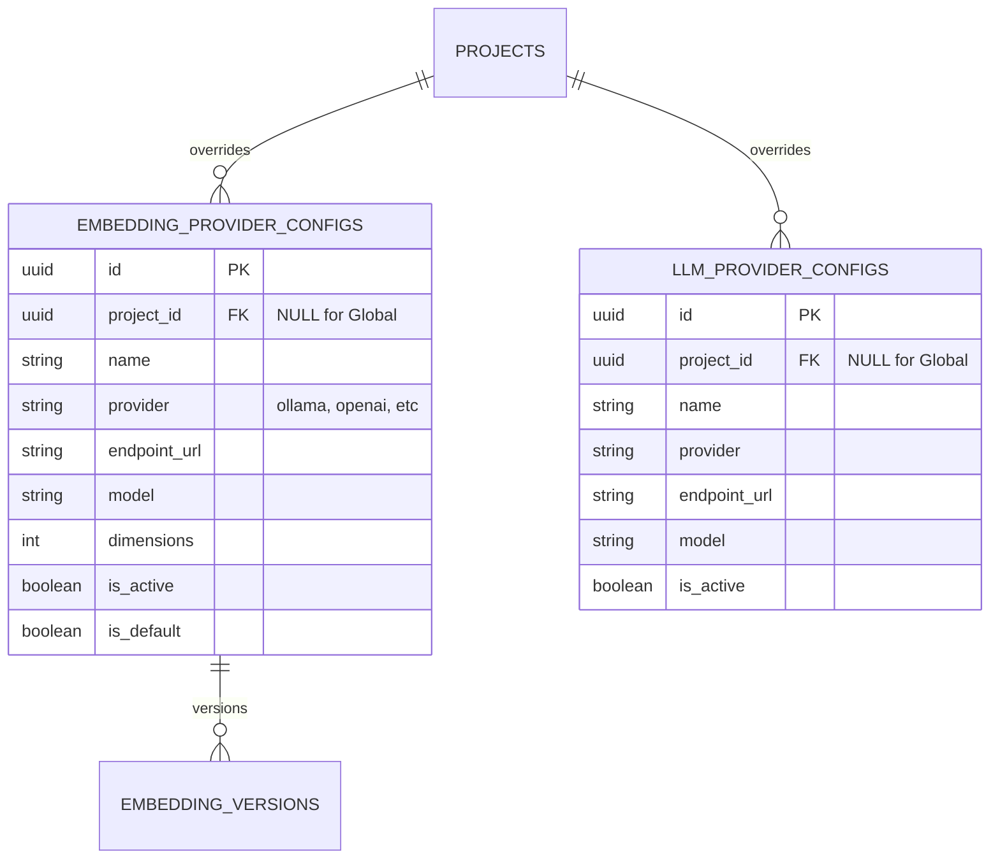
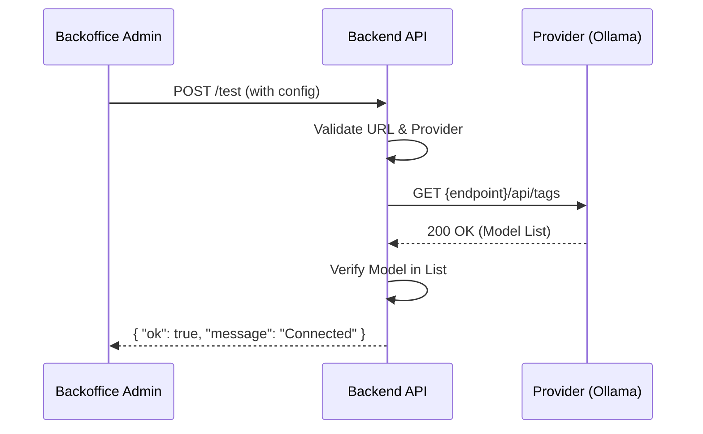

<details>
<summary>Relevant source files</summary>

The following files were used as context for generating this wiki page:

- [datastore/postgres/queries/keys_and_settings.sql](https://github.com/YannickTM/code-intelegence/blob/main/datastore/postgres/queries/keys_and_settings.sql)
- [concept/tickets/backend-api/08-provider-settings.md](https://github.com/YannickTM/code-intelegence/blob/main/concept/tickets/backend-api/08-provider-settings.md)
- [concept/tickets/backend-api/08-provider-settings.md](https://github.com/YannickTM/code-intelegence/blob/main/concept/tickets/backend-api/08-provider-settings.md)
- [concept/tickets/backoffice/14-platform-admin.md](https://github.com/YannickTM/code-intelegence/blob/main/concept/tickets/backoffice/14-platform-admin.md)
- [concept/tickets/backoffice/05-project-providers-keys.md](https://github.com/YannickTM/code-intelegence/blob/main/concept/tickets/backoffice/05-project-providers-keys.md)
- [concept/tickets/backend-worker/09-pipeline.md](https://github.com/YannickTM/code-intelegence/blob/main/concept/tickets/backend-worker/09-pipeline.md)

</details>

# Multi-Provider & LLM Configuration

The Multi-Provider and LLM Configuration system provides a flexible, two-tier architecture for managing AI model providers across the platform. It allows platform administrators to define global defaults and available configurations while granting project administrators the ability to override these settings with project-specific credentials or models.

This system supports two primary capabilities: **Embeddings** (for vectorizing code chunks) and **LLMs** (for generating file descriptions and code summaries). While initially focused on self-hosted Ollama providers, the architecture is designed to be provider-agnostic, supporting future integrations with OpenAI, Voyage, and other compatible REST APIs.

Sources: [concept/tickets/backend-api/08-provider-settings.md](), [concept/tickets/backend-api/08-provider-settings.md]()

## Architecture and Resolution Logic

The system utilizes a hierarchical resolution strategy to determine the effective configuration for any given project activity, such as indexing or generating summaries. This ensures that the platform remains functional out-of-the-box with global defaults but remains highly customizable for individual projects.

### Configuration Tiers
1.  **Global Tier:** Server-wide defaults managed by the `platform_admin`. These are used when a project has no specific override.
2.  **Project Tier:** Per-project overrides managed by Project Admins or Owners. A project can either use the active global default, select a specific global config permitted for project use, or define a completely custom configuration.

Sources: [concept/tickets/backend-api/08-provider-settings.md](), [concept/tickets/backoffice/05-project-providers-keys.md]()

### Resolution Flow
When a project requires an embedding or LLM provider, the system follows this order:


The diagram shows the priority chain where specific overrides always take precedence over broader defaults.
Sources: [concept/tickets/backend-api/08-provider-settings.md](), [concept/tickets/backend-api/08-provider-settings.md]()

## Database Schema and Data Model

The configuration is persisted in PostgreSQL using an "immutable append" pattern. Instead of updating existing rows, the system deactivates the current record and inserts a new one, preserving the configuration history.

### Core Tables
*   **`embedding_provider_configs`**: Stores settings for embedding models (e.g., dimensions, max tokens).
*   **`llm_provider_configs`**: Stores settings for LLM generation models (e.g., model name, endpoint).
*   **`embedding_versions`**: Links configurations to specific version labels to prevent mixing vectors from different models in the same collection.


The entity-relationship diagram illustrates the optional `project_id` which facilitates the two-tier global/project structure.
Sources: [concept/tickets/backend-api/08-provider-settings.md](), [concept/tickets/backend-api/08-provider-settings.md]()

## Provider Management

### Supported Providers
In the initial implementation, the platform primarily supports **Ollama**. However, the implementation includes abstractions for OpenAI-compatible APIs.

| Feature | Embedding Config | LLM Config |
| :--- | :--- | :--- |
| **Provider** | Ollama, OpenAI (future) | Ollama, OpenAI-compatible |
| **Model** | Required (e.g., `mxbai-embed-large`) | Required (e.g., `llama3`) |
| **Dimensions** | Required (e.g., 768, 1024) | N/A |
| **Max Tokens** | Required (e.g., 8000) | N/A |
| **Credentials** | Encrypted JSON | Encrypted JSON |

Sources: [concept/tickets/backend-api/08-provider-settings.md](), [concept/tickets/backoffice/14-platform-admin.md]()

### Connectivity Testing
Both the API and Backoffice provide "Test Connection" functionality. This allows administrators to validate settings before persistence. For Ollama, the system typically pings the `/api/tags` endpoint to verify the model is available.


The sequence diagram shows the validation flow for testing a provider configuration.
Sources: [concept/tickets/backend-api/08-provider-settings.md](), [concept/tickets/backend-api/08-provider-settings.md]()

## Technical Implementation Details

### Configuration Resolution Query
The resolution logic is implemented in SQL using a `UNION` or `OR` approach combined with a specific sort order where `project_id` being non-null takes precedence.

```sql
-- Example Resolution Query for Embeddings
SELECT * FROM embedding_config
WHERE is_active = TRUE
  AND (project_id = $1 OR project_id IS NULL)
ORDER BY project_id NULLS LAST
LIMIT 1;
```
Sources: [concept/tickets/backend-api/08-provider-settings.md](), [datastore/postgres/queries/keys_and_settings.sql:5-20]()

### LLM Client (Worker-Side)
On the worker side, the `Describer` interface handles the actual interaction with the configured LLM. Key features include:
*   **Input Truncation:** Large files are truncated (e.g., to 15,000 characters) to fit model context windows.
*   **Timeout Management:** Default 30s timeout per request to prevent hanging jobs.
*   **Error Categorization:** Distinguishes between rate limits, model availability, and connection failures.

Sources: [concept/tickets/backend-worker/09-pipeline.md]()

### API Endpoints
The platform exposes several management endpoints gated by specific roles.

| Method | Path | Role |
| :--- | :--- | :--- |
| `GET` | `/v1/platform-management/settings/embedding` | `platform_admin` |
| `PUT` | `/v1/platform-management/settings/embedding` | `platform_admin` |
| `GET` | `/v1/projects/{id}/settings/embedding/resolved` | project member |
| `PUT` | `/v1/projects/{id}/settings/embedding` | project admin+ |

Sources: [concept/tickets/backend-api/08-provider-settings.md](), [concept/tickets/backend-api/08-provider-settings.md]()

## Conclusion
The Multi-Provider and LLM Configuration system enables a scalable way to manage AI infrastructure within the MYJUNGLE platform. By separating global defaults from project overrides and providing robust testing tools, it ensures that both administrators and end-users have the necessary controls to maintain high-quality code intelligence across diverse repository environments.
