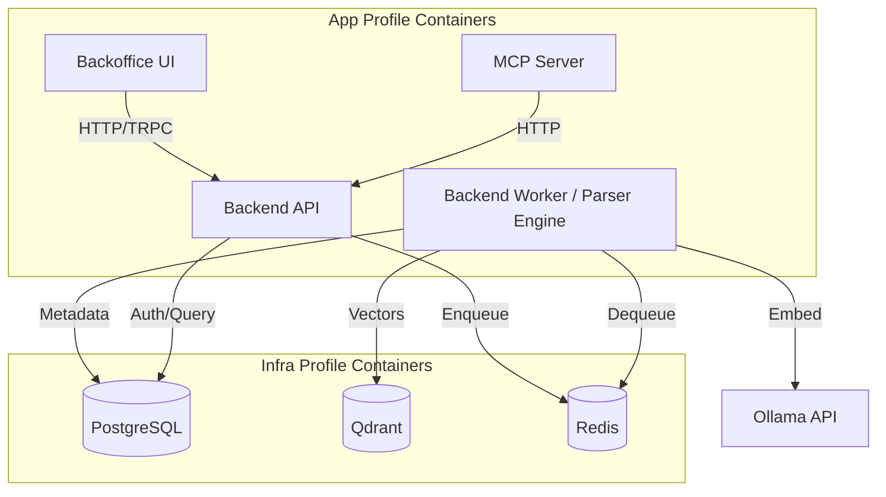

<details>
<summary>Relevant source files</summary>

The following files were used as context for generating this wiki page:

- [DOCKER.md](https://github.com/YannickTM/code-intelegence/blob/main/DOCKER.md)
- [docker-compose.yaml](https://github.com/YannickTM/code-intelegence/blob/main/backend-worker/testdata/parser/golden/yaml/docker-compose-yml.json)
- [concept/tickets/backend-api/01-foundation.md](https://github.com/YannickTM/code-intelegence/blob/main/concept/tickets/backend-api/01-foundation.md)
- [concept/tickets/backend-worker/01-foundation.md](https://github.com/YannickTM/code-intelegence/blob/main/concept/tickets/backend-worker/01-foundation.md)
- [concept/tickets/backend-worker/01-foundation.md](https://github.com/YannickTM/code-intelegence/blob/main/concept/tickets/backend-worker/01-foundation.md)
- [README.md](https://github.com/YannickTM/code-intelegence/blob/main/README.md)
</details>

# Docker Deployment Runbook

The MYJUNGLE Code Intelligence Platform utilizes Docker Compose as its primary runtime for local development and initial self-hosted staging environments. This runbook defines the architecture, build processes, and operational procedures for deploying the multi-component stack using containerization.

The deployment scope includes infrastructure services (PostgreSQL, Redis, Qdrant) and application-specific services (Backend API, Worker, MCP Server, and Backoffice).

Sources: [DOCKER.md:3-8](), [README.md:16-27]()

## System Architecture and Topology

The platform is organized into a distributed architecture where the Backend API serves as the central control plane, and the Backend Worker handles long-running indexing tasks. These services interact with various specialized datastores and external providers.

### Component Relationship Diagram

This diagram illustrates the connectivity between application services and the underlying infrastructure.



Sources: [README.md:29-41](), [DOCKER.md:10-12]()

## Build Configuration

The project uses a Go workspace (`go.work`) at the repository root, requiring that build contexts for Go-based services are set to the root directory.

### Service Build Specifications

| Service | Dockerfile Path | Build Context | Description |
| :--- | :--- | :--- | :--- |
| `backend-api` | `./backend-api/Dockerfile` | Repo Root | Go-based REST API and management plane. |
| `backend-worker` | `./backend-worker/Dockerfile` | Repo Root | Go-based indexing worker with the integrated Tree-sitter parser engine (CGO enabled). |
| `mcp-server` | `./mcpserver/Dockerfile` | `./mcpserver` | Model Context Protocol implementation. |
| `backoffice` | `./backoffice/Dockerfile` | `./backoffice` | Next.js/Vite administrative dashboard. |

Sources: [DOCKER.md:14-22](), [concept/tickets/backend-api/01-foundation.md](), [concept/tickets/backend-worker/01-foundation.md]()

### Multi-Stage Build Logic (Backend Worker)

The Backend Worker uses a multi-stage build to ensure a minimal runtime image while supporting CGO dependencies for the integrated parser.

```dockerfile
# Stage 1: Builder
FROM golang:1.24-alpine AS builder
RUN apk add --no-cache gcc musl-dev git
WORKDIR /build
COPY backend-worker/go.mod backend-worker/go.sum ./
RUN go mod download
COPY backend-worker/ ./
RUN CGO_ENABLED=1 go build -ldflags '-s -w -extldflags "-static"' -o /out/worker ./cmd/worker

# Stage 2: Runtime
FROM alpine:3.21
RUN apk add --no-cache ca-certificates tini git openssh-client
COPY --from=builder /out/worker /usr/local/bin/worker
USER worker
ENTRYPOINT ["tini", "--", "/usr/local/bin/worker"]
```

Sources: [concept/tickets/backend-worker/01-foundation.md]()

## Operational Procedures

### Startup and Profiles

Docker Compose is categorized into two profiles to allow independent infrastructure management.

1.  **Default Profile**: Starts only `postgres`, `qdrant`, and `redis`.
2.  **App Profile**: Starts all application services.

**Command Reference:**

```bash
# Start infrastructure only
docker compose up -d

# Start full stack (including application)
docker compose --profile app up -d --build

# Start backend services only (exclude UI)
docker compose -f docker-compose.backend.yaml up -d --build
```

Sources: [DOCKER.md:10-43]()

### Environment Configuration

Overrides are managed via a `.env` file in the repository root.

| Variable | Default/Example | Purpose |
| :--- | :--- | :--- |
| `POSTGRES_DB` | `codeintel` | Primary relational database name. |
| `OLLAMA_URL` | `http://host.docker.internal:11434` | External LLM/Embedding provider. |
| `SSH_KEY_ENCRYPTION_SECRET` | `[required]` | Secret for encrypting Git SSH keys at rest. |
| `PARSER_POOL_SIZE` | `4` | Number of concurrent parser instances. |
| `REPO_CACHE_DIR` | `/data/cache` | Persistent volume path for cloned repositories. |

Sources: [DOCKER.md:52-64](), [concept/tickets/backend-worker/01-foundation.md]()

## Data Persistence

Persistence is achieved through named Docker volumes to ensure data survives container restarts and upgrades.

*   `postgres_data`: Relational metadata and user records.
*   `qdrant_data`: Vector embeddings for semantic search.
*   `redis_data`: Queue state and worker heartbeats.
*   `repo_cache`: Local clones of repositories used during indexing.

Sources: [DOCKER.md:83-88](), [concept/tickets/backend-worker/01-foundation.md]()

## Health and Troubleshooting

### Health Check Mechanisms

Services implement health checks to ensure dependencies are ready before startup.

*   **PostgreSQL**: Uses `pg_isready` to signal readiness to the API and Worker.
*   **API**: Requires the database to be healthy before starting migrations (`--migrate` flag).
*   **Worker**: Publishes a TTL-bound heartbeat to Redis every 10 seconds.
*   **Parser Runtime**: Initializes inside `backend-worker`; startup failures surface as worker container startup errors rather than a separate service health probe.

Sources: [backend-worker/testdata/parser/golden/yaml/docker-compose-yml.json:56-60](), [concept/tickets/backend-worker/01-foundation.md]()

### Troubleshooting Common Issues

| Symptom | Probable Cause | Resolution |
| :--- | :--- | :--- |
| Build Failures | Missing Go modules or incorrect repo-root build context | Ensure build is run from repo root for Go services. |
| Embedding Failures | Ollama unreachable | Verify `OLLAMA_URL` and model availability via `/api/tags`. |
| Indexing Stuck | Redis saturation | Check worker logs and Redis `asynq` queue depth. |
| Parser Startup Failure | Native grammar or CGO initialization issue | Verify CGO build flags and bundled Tree-sitter grammar bindings in `backend-worker`. |

Sources: [DOCKER.md:92-120](), [concept/tickets/backend-worker/01-foundation.md]()

## Deployment Conclusion

The Docker deployment configuration provides a resilient, reproducible environment for the MYJUNGLE platform. By separating infrastructure from the application lifecycle and utilizing multi-stage builds, the platform maintains a small footprint while supporting complex requirements such as CGO-based parsing and persistent repository caching.
