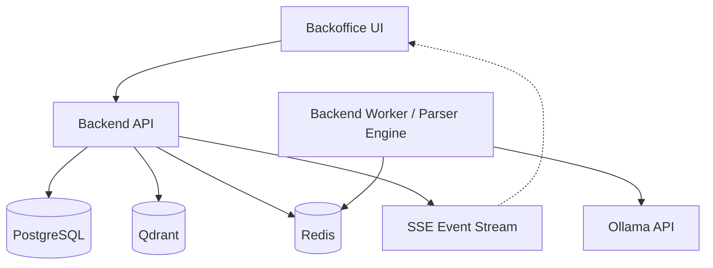
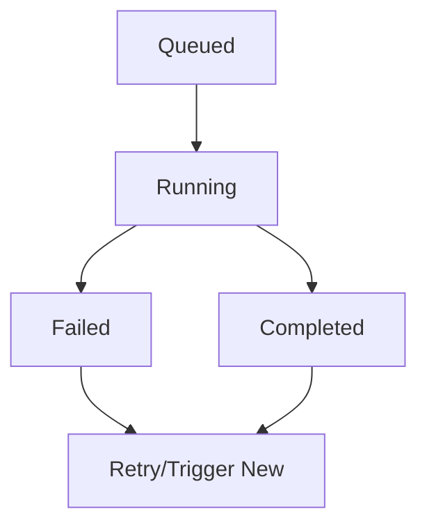

Relevant source files

The following files were used as context for generating this wiki page:

- [README.md](https://github.com/YannickTM/code-intelegence/blob/main/README.md)
- [concept/05-backoffice-ui.md](https://github.com/YannickTM/code-intelegence/blob/main/concept/05-backoffice-ui.md)
- [concept/tickets/backoffice/14-platform-admin.md](https://github.com/YannickTM/code-intelegence/blob/main/concept/tickets/backoffice/14-platform-admin.md)
- [concept/tickets/backoffice/06-indexing-monitor.md](https://github.com/YannickTM/code-intelegence/blob/main/concept/tickets/backoffice/06-indexing-monitor.md)

# Operations & Troubleshooting Guide

This guide provides technical specifications for monitoring, managing, and troubleshooting the MYJUNGLE Code Intelligence Platform. It covers system health monitoring, worker status tracking, indexing job management, and diagnostic extraction.

The primary operational interface is the **Backoffice UI**, a React-based dashboard designed for platform administrators to observe system health, manage infrastructure components like SSH keys and API keys, and debug failed indexing pipelines.
Sources: [README.md:1-10](), [concept/05-backoffice-ui.md:1-10]()

## System Health & Infrastructure Monitoring

The platform relies on a distributed architecture consisting of Go-based APIs and workers, an embedded parser engine inside `backend-worker`, and multiple data stores (PostgreSQL, Qdrant, Redis). Monitoring these components involves checking their connectivity and lifecycle states.

### Service Health Checks
The System section of the Backoffice provides real-time health checks for the following services:
*   **Backend API & Worker**: Core orchestration, execution logic, and embedded parsing runtime.
*   **Datastores**: PostgreSQL (Metadata), Qdrant (Vectors), and Redis (Queue/Events).
*   **External Providers**: Ollama (Embeddings).

Sources: [README.md:20-30](), [concept/05-backoffice-ui.md:105-110]()

### Component Topology
The following diagram illustrates the operational relationship between the system components and the monitoring flow.

The Backoffice receives live updates via a Server-Sent Events (SSE) bridge from the Backend API, which reflects state changes in the underlying workers and datastores.
Sources: [README.md:32-41](), [concept/05-backoffice-ui.md:115-125]()

## Worker Operations

Platform administrators can monitor active worker instances through the `Platform Worker Status View`. This view reads heartbeat data from Redis to determine the availability and current load of the worker pool.

### Worker States
Workers report their status through the following lifecycle states:

| Status | Description | Color Indicator |
| :--- | :--- | :--- |
| `starting` | Worker is initializing. | Yellow/Amber |
| `idle` | Worker is ready but has no active job. | Green |
| `busy` | Worker is currently processing a job. | Blue |
| `draining` | Worker is finishing current work before stopping. | Orange |
| `stopped` | Worker is in the process of shutting down. | Gray |

Sources: [concept/tickets/backoffice/14-platform-admin.md]()

### Worker Diagnostic Data
The worker status table includes metadata critical for troubleshooting performance or version mismatches:
*   **Hostname & Version**: Identifies specific container instances and software versions.
*   **Uptime & Heartbeat**: Calculated relative times (e.g., "5s ago") to detect hung processes.
*   **Current Job/Project**: Provides context on what a `busy` worker is currently processing.
*   **Drain Reason**: Explains why a worker is entering the `draining` state (visible via tooltip).

Sources: [concept/tickets/backoffice/14-platform-admin.md]()

## Indexing & Job Troubleshooting

Indexing is the most complex operational task, involving repository cloning, parsing, and vectorization. Failures in this pipeline are tracked and surfaced in the Project Indexing tab.

### Job Lifecycle
Jobs transition through four primary states. The Backoffice uses a polling mechanism (or SSE) to update these statuses every 3 seconds while active jobs exist.

Sources: [concept/tickets/backoffice/06-indexing-monitor.md]()

### Debugging Failed Jobs
When a job fails, the system captures `error_details` as an array of strings. In the Backoffice UI, failed rows expand to reveal these details in a monospace block, allowing developers to identify issues such as authentication errors, parse timeouts, or LLM connectivity failures.
Sources: [concept/tickets/backoffice/06-indexing-monitor.md]()

### Indexing Metadata
Key metrics for verifying index integrity:
*   **Files Processed**: Total count of files successfully read.
*   **Chunks Upserted**: Number of code blocks sent to the vector database.
*   **Vectors Deleted**: Number of stale vectors removed during incremental updates.

Sources: [concept/tickets/backoffice/06-indexing-monitor.md]()

## Code Analysis Diagnostics

The embedded parser engine in `backend-worker` generates structural diagnostics and parse errors that help identify why certain code sections might be missing from the index.

### Parse Errors
The system detects syntax issues using Tree-sitter. To prevent log flooding, errors are capped and merged:
*   **Cap**: A maximum of 50 error nodes are reported per file.
*   **Merging**: Consecutive errors on the same line are collapsed into a single diagnostic with a count (e.g., "Unexpected token (and 2 more on this line)").

### Structural Warnings
The parser flags code that might be difficult for AI agents to process or that indicates high complexity:

| Code | Severity | Description |
| :--- | :--- | :--- |
| `LONG_FUNCTION` | WARNING | Functions exceeding 200 lines. |
| `LONG_FILE` | INFO | Files exceeding 1000 lines. |
| `DEEP_NESTING` | WARNING | Code nested deeper than 6 levels (if/for/while/try). |
| `NO_EXPORTS` | INFO | File contains declarations but no exports, limiting its utility. |

### Operational Errors
These diagnostics represent failures in the parser engine's execution environment rather than the user's code:
*   **`UNSUPPORTED_LANGUAGE`**: Triggered when a file extension is not in the recognized set.
*   **`OVERSIZED_FILE`**: Triggered when a file exceeds `MAX_FILE_SIZE_BYTES`.
*   **`PARSE_TIMEOUT`**: Triggered when parsing a file exceeds the configured time limit (default 30s).
*   **`EXTRACTION_ERROR`**: Indicates an internal extractor threw an exception.

## Docker & Deployment Operations

The system is deployed using a multi-container Docker architecture. Ensuring stability requires proper health checks and signal handling.

### Container Health Checks
The worker runtime no longer depends on a separate parser service health probe. Parser availability is part of the `backend-worker` process itself:
*   **Worker startup**: If the embedded parser engine fails to initialize, the worker container fails during startup.
*   **Worker heartbeat**: A healthy worker publishes Redis heartbeats every 10 seconds with a 30-second TTL, which the Backoffice uses for liveness monitoring.

### Graceful Shutdown
To prevent data corruption or dropped jobs, internal services must handle `SIGTERM` and `SIGINT` signals:
1.  **Drain**: Stop accepting new queue work and finish any in-flight job safely.
2.  **Clean up**: Shut down the parser pool and close database connections.
3.  **Exit**: Terminate the process cleanly.

The MYJUNGLE platform is designed for high observability, providing detailed insights into worker health, job progress, and code-level diagnostics. By utilizing the Backoffice UI and monitoring the diagnostic codes surfaced by the parser, operators can maintain system reliability and resolve indexing bottlenecks effectively.
