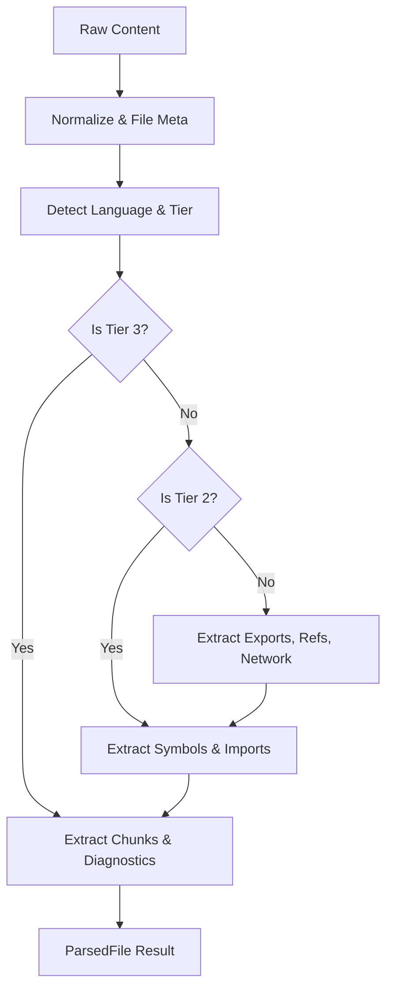

<details>
<summary>Relevant source files</summary>

The following files were used as context for generating this wiki page:

- [concept/tickets/backend-worker/05-parser-engine.md](https://github.com/YannickTM/code-intelegence/blob/main/concept/tickets/backend-worker/05-parser-engine.md)
- [concept/tickets/backend-worker/08-extractors-chunks-diagnostics.md](https://github.com/YannickTM/code-intelegence/blob/main/concept/tickets/backend-worker/08-extractors-chunks-diagnostics.md)
- [concept/tickets/backend-worker/08-extractors-chunks-diagnostics.md](https://github.com/YannickTM/code-intelegence/blob/main/concept/tickets/backend-worker/08-extractors-chunks-diagnostics.md)
</details>

# Extending Parser Supported Languages

The parser system is designed to provide structured analysis (symbols, imports, chunks, and diagnostics) across multiple programming languages. It utilizes a tiered architecture where different languages receive varying depths of extraction based on their complexity and the available Tree-sitter grammars. Extending the supported languages involves registering new language configurations, mapping file extensions, and defining extraction patterns for AST nodes.

This system supports a range of languages categorized into three distinct tiers, ensuring that the backend can handle everything from full semantic analysis of languages like TypeScript and Go to basic structural chunking for markup languages like HTML or JSON.

## Language Tier Architecture

The parser categorizes supported languages into three tiers, which dictate the level of extraction performed by the pipeline.

| Tier | Name | Extraction Depth | Examples |
| :--- | :--- | :--- | :--- |
| **Tier 1** | Full Extraction | Symbols, Imports, Exports, References, Chunks, Diagnostics | JavaScript, Python, Go, Rust, Java, C#, PHP |
| **Tier 2** | Partial Extraction | Symbols, Imports, Chunks, Diagnostics | Bash, SQL, GraphQL, Dockerfile |
| **Tier 3** | Structural Only | Chunks, Diagnostics, Minimal Symbols | HTML, CSS, JSON, YAML, Markdown, XML |

### Pipeline Flow by Tier
The following diagram illustrates how the language tier affects the execution of extraction modules within the parser engine.


The extraction logic follows a progressive inclusion strategy based on the language tier.
Sources: [concept/tickets/backend-worker/05-parser-engine.md]()

## The Language Registry

The `LanguageRegistry` serves as the single source of truth for multi-language support. It stores `LanguageConfig` objects that define how the parser should interpret the AST for a specific language ID.

### Configuration Schema
A `LanguageConfig` includes several critical fields:
*   **Identification**: `id`, `tier`, `extensions`, and `basenames` (e.g., "Dockerfile").
*   **Symbol Extraction**: `symbolNodeTypes` mapping AST node types to symbol kinds (e.g., `function_declaration` -> `function`).
*   **Import/Export Patterns**: Node types for imports and specific `exportStrategy` (keyword-based like `pub` or convention-based like Go's uppercase rule).
*   **File Patterns**: Glob patterns for identifying test files (`testFilePatterns`) and configuration files (`configFilePatterns`).
*   **Diagnostics**: `nestingNodeTypes` used to calculate cyclomatic complexity/nesting depth warnings.

Sources: [concept/tickets/backend-worker/08-extractors-chunks-diagnostics.md]()

### Language Identification Logic
The parser identifies languages using a two-step process: extension mapping and basename matching.

1.  **Extension Mapping**: The parser checks the file extension against a map (e.g., `.py` -> `python`, `.go` -> `go`).
2.  **Basename Detection**: For files without extensions or with specific naming conventions, it checks the basename (e.g., `Gemfile` -> `ruby`, `Dockerfile` -> `dockerfile`).
3.  **Ambiguity Handling**: Extensions like `.h` are treated as C++ by default unless context indicates otherwise.

## Steps to Add a New Language

Extending the parser with a new language requires updates across both the configuration registry and the underlying Tree-sitter infrastructure.

### 1. Install Tree-sitter Grammar
Add the grammar binding to the `backend-worker` module and register it with the parser runtime.
*   **Dependency**: Add the appropriate `github.com/smacker/go-tree-sitter/...` package to `backend-worker/go.mod`.
*   **Grammar registry**: Import the binding in `backend-worker/internal/parser/grammars.go` and add it to `grammarRegistry`.

### 2. Update Extension Maps
The language must be added to the parser registry's extension and basename maps.
*   **File**: `backend-worker/internal/parser/registry/registry.go`
*   **Action**: Add entries for all valid extensions to `extensionMap`, and update `basenameMap` if the language also relies on special filenames.

### 3. Define Language Configuration
Register the detailed `LanguageConfig` in `backend-worker/internal/parser/registry/languages.go`. This involves mapping specific AST nodes for the new language.

```go
"example": {
    ID:         "example",
    Tier:       Tier1,
    Extensions: []string{".ex"},
    SymbolNodeTypes: map[string]string{
        "function_definition": "function",
        "class_definition":    "class",
    },
    ImportNodeTypes:   []string{"import_statement"},
    Export:            ExportStrategy{Type: "keyword", Keyword: "export"},
    TestFilePatterns:  []string{"*.test.ex"},
    ConfigFilePatterns: []string{"config.ex"},
    NestingNodeTypes:  []string{"if_statement", "loop_statement"},
},
```

### 4. Configure Extraction Strategy
Different languages require specific extraction logic for chunks and diagnostics.
*   **Chunking**: Ensure `ConfigFilePatterns` and `TestFilePatterns` are set to trigger correct chunk types (`CONFIG` vs `MODULE_CONTEXT`).
*   **Diagnostics**: Define `NestingNodeTypes` to enable `DEEP_NESTING` warnings. Set `hasExplicitExports` to `true` if the language uses an export keyword, enabling `NO_EXPORTS` info diagnostics.

Sources: [concept/tickets/backend-worker/08-extractors-chunks-diagnostics.md](), [concept/tickets/backend-worker/08-extractors-chunks-diagnostics.md]()

## Verification and Testing

New languages must pass a standard suite of tests to ensure extraction accuracy and pipeline stability.

*   **Language Detection**: Verify that extensions and basenames resolve to the correct language ID in `backend-worker/internal/parser/registry/registry_test.go`.
*   **Symbol/Import Accuracy**: Ensure the defined node type mappings correctly extract symbols and dependency edges.
*   **Chunk Determinism**: Confirm that chunk boundaries are stable and that Tier 3 languages correctly produce single-file chunks.
*   **Diagnostic Integrity**: Verify that syntax errors are captured and that structural warnings (like deep nesting) fire based on the language-specific node types.

Sources: [concept/tickets/backend-worker/05-parser-engine.md]()

## Summary

Extending the parser's language support is a structured process of defining how the Tree-sitter AST maps to the project's internal data model. By leveraging the tiered architecture and the centralized language registry, developers can add support for new languages ranging from full-featured programming environments to simple configuration formats while maintaining consistency in output artifacts and extraction performance.
